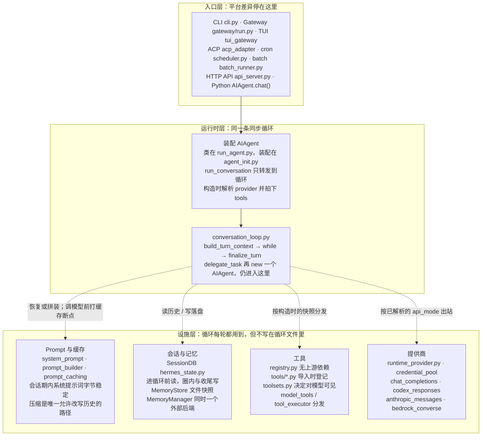
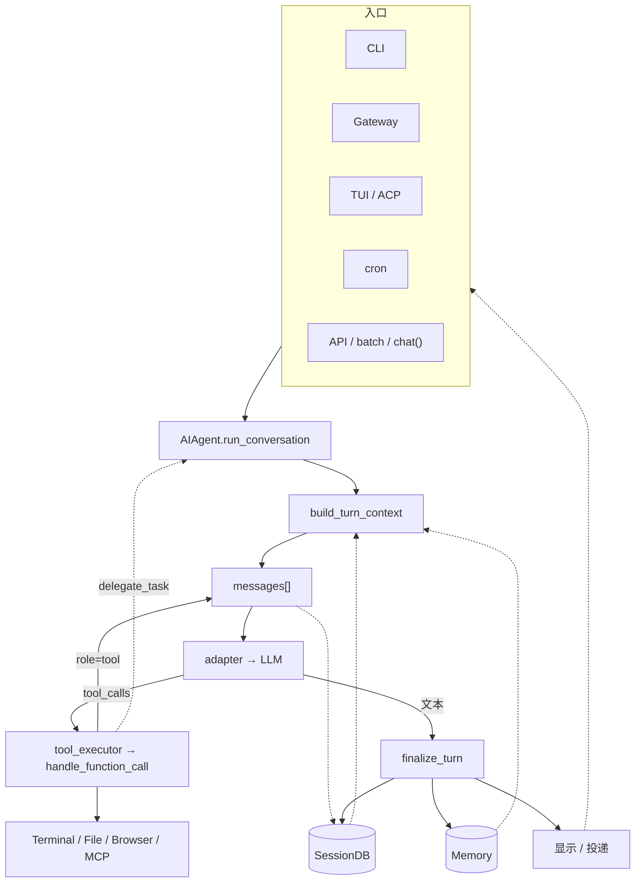

> 本文基于 Hermes Agent v0.20.0（tag `v2026.8.3`，commit `3c27eb623`）源码，文中所有文件路径与行号均以该版本为准。

## Hermes Agent 是什么

Hermes 是 Nous Research 开源的自主 AI 智能体。Claude Code、OpenClaw 等框架要么是无状态的，要么只有被动记忆——你告诉它记住什么，它才记住什么。Hermes Agent 最核心的差异化能力，是一套闭环学习系统——从执行轨迹中自动提炼并持续优化技能的学习闭环。Hermes 的记忆是主动积累的：它观察你，自己总结，自己改进。

Hermes的Memory做得很薄,只有两份纯文本：`MEMORY.md` 记环境事实、项目约定、工具特性；`USER.md` 记用户偏好、沟通风格、工作习惯，默认上限 1375 字符（`tools/memory_tool.py:165-169` ）。新会话开始时，这两份文件作为冻结快照写进系统提示词；本会话里用 `memory` 工具改磁盘，提示词要到下一会话才换。设置容量有上限来倒逼模型整理出最重要的记忆避免无限追加。

Hermes的技能这一层解决同类任务下次怎么少探索这个问题。主循环达到阈值且本轮已经把回答交给用户后，`finalize_turn` 会再 fork 一个后台审查 Agent（`agent/background_review.py` ），只允许读写记忆和技能，写入落在磁盘上，正在进行的对话和提示词缓存不动。审查结果若写成技能，下次同类任务可以按这份说明执行。Curator（`agent/curator.py` ）在 agent 空闲时用侧路模型复查由agent创建的技能，可以归档、合并或打补丁。公开介绍里的「批量进化算法」「完成复杂任务即自动生成技能」，对应的就是这两段机制。所谓进化是技能的进化而非系统提示词的改变，不要理解成主循环边回答边改自己的系统提示词。

此外，Hermes 还支持通过 FTS5 全文检索实现跨会话的长期情景记忆，并可通过 Honcho 等插件进行辩证式用户建模，在多次交互中持续深化对用户特征的理解。

## 系统概览

Hermes 的内部结构可以分成三层。入口把 CLI、网关、定时任务等外部事件译成一次 `run_conversation` 调用；运行时是不可按平台分叉——类定义在 `run_agent.py` ，装配在 `agent/agent_init.py` ，while 在 `agent/conversation_loop.py` ；Prompt、SessionDB、工具注册表、提供商解析是设施，被循环调用，但不定义循环。

官方 Architecture 页仍把循环画在 `run_agent.py` 并写三种 API 模式，与当前源码不符，注意甄别。




## 目录结构

```text
hermes-agent/
├── run_agent.py                    # AIAgent 类；run_conversation 仅为转发器
├── cli.py                          # HermesCLI — 交互式终端 UI（大文件）
├── model_tools.py                  # 工具发现、schema 收集、handle_function_call
├── toolsets.py                     # 工具分组；_HERMES_CORE_TOOLS 默认清单
├── hermes_state.py                 # SessionDB（SQLite + FTS5）
├── hermes_constants.py             # get_hermes_home() / display_hermes_home()
├── hermes_logging.py               # agent.log / errors.log / gateway.log
├── batch_runner.py                 # 批量轨迹生成
│
├── agent/                          # 运行时内部（循环已从 run_agent.py 抽出）
│   ├── conversation_loop.py        # 真正的 while
│   ├── turn_context.py             # 每轮准备（系统提示词恢复/拼装、prefetch）
│   ├── turn_finalizer.py           # 循环后收尾
│   ├── agent_init.py               # AIAgent 装配、拍下本会话工具 schema
│   ├── system_prompt.py            # 系统提示词三层：stable / context / volatile
│   ├── prompt_builder.py           # 项目文件、技能索引等拼进 prompt
│   ├── prompt_caching.py           # Anthropic prompt 缓存断点
│   ├── context_engine.py           # ContextEngine ABC（可插拔）
│   ├── context_compressor.py       # 默认引擎——有损摘要压缩
│   ├── conversation_compression.py # 压缩入口；默认 in-place
│   ├── tool_executor.py            # 工具批次执行（含并行段）
│   ├── memory_manager.py           # 外部记忆编排（同时一个后端）
│   ├── memory_provider.py          # MemoryProvider ABC
│   ├── auxiliary_client.py         # 侧路 LLM（压缩、视觉、标题等）
│   ├── credential_pool.py          # 多密钥轮换
│   ├── anthropic_adapter.py        # Anthropic Messages API 格式转换
│   ├── display.py                  # KawaiiSpinner、工具预览格式化
│   ├── skill_commands.py           # Skill 斜杠命令
│   ├── curator.py                  # 后台技能生命周期
│   └── trajectory.py               # 离线 ShareGPT 轨迹（≠ 在线压缩）
│
├── hermes_cli/                     # CLI 子命令与设置
│   ├── main.py                     # `hermes` 入口；先 _apply_profile_override
│   ├── config.py                   # DEFAULT_CONFIG、OPTIONAL_ENV_VARS、迁移
│   ├── commands.py                 # COMMAND_REGISTRY——斜杠命令中央定义
│   ├── auth.py                     # PROVIDER_REGISTRY、凭据解析
│   ├── runtime_provider.py         # Provider → api_mode + 凭据
│   ├── models.py                   # 模型目录、provider 模型列表
│   ├── model_switch.py             # /model 命令逻辑（CLI + gateway 共用）
│   ├── setup.py                    # 交互式设置向导（大文件）
│   ├── skin_engine.py              # CLI 主题引擎
│   ├── skills_config.py            # hermes skills——按平台启用/禁用
│   ├── skills_hub.py               # /skills 斜杠命令
│   ├── tools_config.py             # hermes tools——按平台启用/禁用
│   ├── plugins.py                  # PluginManager——发现、加载、hook
│   ├── callbacks.py                # 终端回调（clarify、sudo、approval）
│   ├── gateway.py                  # hermes gateway 启动/停止
│   ├── web_server.py               # dashboard / serve
│   └── pty_bridge.py               # Dashboard 嵌入 TUI 的 PTY 桥
│
├── tools/                          # 工具实现（导入时自注册）
│   ├── registry.py                 # 中央工具注册表（无上游依赖）
│   ├── approval.py                 # 危险命令检测
│   ├── terminal_tool.py            # 终端编排
│   ├── process_registry.py         # 后台进程管理
│   ├── file_tools.py               # read_file、write_file、patch、search_files
│   ├── web_tools.py                # web_search、web_extract
│   ├── browser_tool.py             # 浏览器自动化工具
│   ├── code_execution_tool.py      # execute_code 沙箱
│   ├── delegate_tool.py            # 子 agent 委托
│   ├── mcp_tool.py                 # MCP 客户端（大文件）
│   ├── credential_files.py         # 基于文件的凭据透传
│   ├── env_passthrough.py          # 沙箱环境变量透传
│   └── environments/               # 终端后端（local、docker、ssh、modal、
│                                   #   daytona、singularity、vercel_sandbox）
│
├── gateway/                        # 消息平台 gateway
│   ├── run.py                      # GatewayRunner——消息分发（大文件）
│   ├── session.py                  # SessionStore——对话持久化
│   ├── delivery.py                 # 出站消息投递
│   ├── pairing.py                  # DM 配对授权
│   ├── hooks.py                    # Hook 发现与生命周期事件
│   ├── mirror.py                   # 跨会话消息镜像
│   ├── status.py                   # Token 锁、profile 范围的进程追踪
│   ├── builtin_hooks/              # 始终注册的 hook 扩展点（当前无内置）
│   └── platforms/                  # 内置适配器：signal、weixin、bluebubbles、
│                                   #   qqbot、whatsapp_cloud、yuanbao、
│                                   #   webhook、api_server
│
├── plugins/platforms/              # 捆绑平台插件：telegram、discord、slack、
│                                   #   whatsapp、matrix、mattermost、email、sms、
│                                   #   dingtalk、feishu、wecom、homeassistant、
│                                   #   irc、line、teams、google_chat、buzz、
│                                   #   ntfy、photon、raft、simplex、a2a
├── plugins/memory/                 # 记忆提供者（honcho、mem0、…；同时只用一个）
├── plugins/model-providers/        # 推理后端 profile
├── plugins/context_engine/         # 上下文引擎插件
├── plugins/image_gen/              # 图像生成提供者
├── plugins/kanban/                 # 多代理看板等
│
├── tui_gateway/                    # Ink TUI 的 Python JSON-RPC 后端
├── ui-tui/                         # Ink（React）终端 UI — `hermes --tui`
├── apps/desktop/                   # Electron 桌面；连 hermes serve，不嵌 TUI
├── apps/shared/                    # 桌面与 Dashboard 共用的 JSON-RPC 传输
├── web/                            # Dashboard 前端（Vite）
├── acp_adapter/                    # ACP 服务器（VS Code / Zed / JetBrains）
├── cron/                           # 调度器（jobs.py、scheduler.py）
├── skills/                         # 内置 skill（始终可用）
├── optional-skills/                # 官方可选 skill（需显式安装）
├── website/                        # Docusaurus 文档站点
└── tests/                          # Pytest 测试套件
```


## 三层内部结构：

### 一、入口层

入口层把外部世界接到同一条循环上，自身不实现 tool-calling。

进程真正的启动点是 `hermes_cli/main.py` 。在导入会缓存 `HERMES_HOME` 的模块之前，`_apply_profile_override`（`hermes_cli/main.py:517-519` ）先解析 `--profile` / `-p` 并写入环境变量。之后所有状态路径都应走 `get_hermes_home()`（`hermes_constants.py:114-120` ）。Profile 是实例隔离：每个 profile 有自己的配置、密钥、会话库、技能和网关进程。

交互式 CLI 在 `cli.py` 的 `HermesCLI`。读完一行输入后，斜杠命令由 `hermes_cli/commands.py` 的中央注册表分发；自然语言在展开 `@file:` / `@folder:` / `@diff` / `@url:` 一类引用之后，调用 `self.agent.run_conversation`（`cli.py:13971` ）。传入的 `conversation_history` 去掉刚刚写入历史的那条用户消息，避免循环再追加一次。

网关是长驻进程 `gateway/run.py` 。各平台适配器把事件收成统一的消息对象，经授权、会话键、忙时排队之后，同样调用 `agent.run_conversation`（`gateway/run.py:5316` ）。Ink TUI 经 JSON-RPC 到达 `tui_gateway/server.py:9648` 。ACP 在 `acp_adapter/server.py:1908` 。cron 在 `cron/scheduler.py:3582` 。批量在 `batch_runner.py:349` 。HTTP 一侧是 `gateway/platforms/api_server.py` ：兼容 OpenAI 的 `/v1/chat/completions` 、有状态的 `/v1/responses` 、以及带审批的 `/v1/runs` （`gateway/platforms/api_server.py:1-28` ），认证使用 `API_SERVER_KEY`。

桌面 Electron 应用走同一套 `tui_gateway` / `hermes serve` 后端，不嵌入 `hermes --tui`。Dashboard 的 `/chat` 才是把真实 TUI 嵌进浏览器。直接 `from run_agent import AIAgent` 再调用 `chat()`（`run_agent.py:7723` ）也是入口：`chat()` 只从结果字典取出 `final_response` 字符串，给程序化嵌入用。

入口文件可以很长（`cli.py` 、`gateway/run.py` 均为万行级），但就对话语义而言，其职责止于构造 `AIAgent` 并调用转发器。平台差异、排队、投递、斜杠命令菜单都留在这一层。

### 二、运行时层

运行时层由 `AIAgent` 与 `conversation_loop` 构成。`AIAgent.__init__` 的参数很多（凭证、工具集、回调、session_id、是否跳过记忆等），实际装配集中在 `agent/agent_init.py` 的 `init_agent`。此处解析提供商、拍下本会话可见的工具 schema（`agent/agent_init.py:1419-1423` 调用 `get_tool_definitions`），并挂上 SessionDB、记忆与回调。工具清单在会话初始化时固定；中途更换会破坏提示词缓存。

`run_conversation` 进入循环前先调用 `build_turn_context`（调用点 `conversation_loop.py:1297` ，定义在 `agent/turn_context.py:330` ）：恢复或构造系统提示词、把用户消息入列、必要时做压缩预检、把外部记忆 prefetch 与插件 `pre_llm_call` 写到本轮 user 消息的 `api_content` sidecar 上。已有会话的系统提示词从 SessionDB **原样**读出上次使用的字节（`conversation_loop.py:470-537` ），新会话才按 stable / context / volatile 三层拼装一次（`agent/system_prompt.py:1-16` ）。

随后进入 while（`agent/conversation_loop.py:1402` ）。循环看的是 `agent.max_iterations`。CLI / 网关 / TUI 从 `config.yaml` 的 `agent.max_turns` 传入（默认 500）；`AIAgent.__init__` 形参默认值 90 只在直接构造且未传该参数时生效。条件为迭代次数与 `IterationBudget` 均有剩余，外加一个从未在生产路径置位的 `_budget_grace_call`（完整收尾实际由循环外的 `finalize_turn` 完成）。每一圈：清洗消息并打缓存断点，调用模型；若响应含 `tool_calls`，先将 assistant 消息入列（协议要求），再执行工具；若无 tool_calls，取出最终文本并退出。工具请求从循环进入 `tool_executor`，再到 `handle_function_call`（`model_tools.py:1096` ）。`todo`、`memory`、`session_search`、`delegate_task` 被标为 `_AGENT_LOOP_TOOLS`（`model_tools.py:667` ）：schema 仍在注册表里，执行却绑定当前 agent 的状态，不能当普通 handler 分发。

退出 while 之后，`finalize_turn` （`agent/turn_finalizer.py:69` ）完成本轮收尾：预算耗尽时发一次去掉工具的总结调用，外部记忆在后台 `sync_turn`，会话落盘。同一 `session_id` 下，下一轮会再次取出同一份系统提示词字节和初始化时的那一份工具 schema。缓存前缀能够跨轮命中，前提正在于此。

循环全程操作 OpenAI 的 `{role, content, tool_calls}` 列表。真正发给各家 API 时，由适配器在边界上转换。运行时合法的 `api_mode` 为 `chat_completions`、`codex_responses`、`anthropic_messages`、`bedrock_converse`；另有一项需显式开启的路径：`model.openai_runtime` 设为 `codex_app_server` 且提供商为 OpenAI / openai-codex 时，整轮交给 Codex 子进程，不再走 Hermes 自己的工具分发（`hermes_cli/runtime_provider.py:380-391` ）。官方架构文档仍写「三种 API 模式」，当前版本以本集合为准。

### 三、执行设施层

设施层是循环每轮都会用到、但不写在 `conversation_loop.py` 里的组件。工具可见性由 `tools/registry.py` 与 `toolsets.py` 决定：任意 `tools/*.py` 在导入时自注册，但只有进入某个 toolset 的名字才会暴露给模型。`_HERMES_CORE_TOOLS`（`toolsets.py:31-86` ）是 CLI 与消息平台默认继承的清单；注释写明桌面 `project_*` 工具被刻意排除，以免污染每一条 CLI / 网关 / cron 的 schema（`toolsets.py:60-64`）。终端、文件、浏览器、MCP 客户端都是这张表上的实现。插件与 MCP 也向同一张 registry 登记。

会话由 `SessionDB` （`hermes_state.py` ）按插入序记录消息，并用 `api_content` sidecar 保存实际上线字节。跨会话笔记是另一套：本地 `MemoryStore` 把 MEMORY.md 一类快照冻进系统提示词；外部 `MemoryProvider` 由 `MemoryManager` 编排，同时只许一个外部后端（`agent/memory_provider.py:1-9` ），以免工具 schema 膨胀。cron 与子代理默认 `skip_memory=True`，避免把调度中间态写进用户画像。

提供商与密钥由 `hermes_cli/runtime_provider.py:1650` 的 `resolve_runtime_provider` 统一解析，CLI、网关、cron、ACP、侧路 LLM 共用。`hermes_cli/runtime_provider.py:587-603` 的 `resolve_requested_provider` 的顺序为：构造参数中显式指定的 provider，其次 `config.yaml` 的 `model.provider`，最后才是环境变量 `HERMES_INFERENCE_PROVIDER`。注释写明：用户上次在 `hermes model` 中选中的端点须压过过期的 shell 导出。压缩、视觉、标题生成等侧任务不进入 while，走 `agent/auxiliary_client.py` 的独立解析链。配置里的 `smart_model_routing` 键会被 setup 写成默认关闭；当前代码树中没有对应的运行时路由器，主循环不会按步更换模型。

`delegate_task` （`tools/delegate_tool.py:2779` ）再构造一个 `AIAgent` 跑同一条循环。子代理使用独立预算、默认跳过记忆；leaf 角色拿不到 `delegate_task`、`clarify`、`memory`、`send_message`、`cronjob`。

## 主要子系统


| 子系统            | 职责                                                                 | 主要代码                                                                                        |
| -------------- | ------------------------------------------------------------------ | ------------------------------------------------------------------------------------------- |
| Agent 循环       | 同步 while：上下文、API、工具、中断、压缩触发、收尾                                     | `agent/conversation_loop.py` 、`turn_context.py` 、`turn_finalizer.py`                        |
| Prompt 与缓存     | 系统提示词三层拼装；会话期内字节稳定；压缩是唯一允许改历史的路径                                   | `agent/system_prompt.py` 、`prompt_builder.py` 、`prompt_caching.py` 、`context_compressor.py` |
| 工具系统           | 注册、toolset 暴露、`check_fn` 门控、分发、错误包装                                | `tools/registry.py` 、`toolsets.py` 、`model_tools.py` 、`tools/*.py`                          |
| 提供商运行时         | `(provider, model)` → `(api_mode, api_key, base_url)`；密钥池与 host 隔离 | `hermes_cli/runtime_provider.py` 、`agent/credential_pool.py`                                |
| 会话与记忆          | SQLite + FTS5；文件记忆快照；外部 MemoryProvider                             | `hermes_state.py` 、`tools/memory_tool.py` 、`agent/memory_manager.py`                        |
| 消息网关           | 多平台适配、授权、会话键、忙时排队、斜杠命令、投递                                          | `gateway/run.py` 、`gateway/platforms/`                                                      |
| 插件与 MCP        | 四源发现；hooks / `ctx.register_tool` / CLI 子命令；MCP 进程登记进同一 registry    | `hermes_cli/plugins.py` 、`tools/mcp_tool.py`                                                |
| 委派             | 同步或后台子代理；完成队列在空闲时新开一轮回注                                            | `tools/delegate_tool.py` 、`agent/async_delegation.py`                                       |
| Cron           | 到期任务构造独立 `AIAgent`；默认不镜像进用户主会话                                     | `cron/jobs.py` 、`cron/scheduler.py`                                                         |
| TUI / ACP / 桌面 | Ink+JSON-RPC；编辑器协议；Electron 连 headless serve                       | `ui-tui/` 、`tui_gateway/` 、`acp_adapter/` 、`apps/desktop/`                                  |
| 配置             | 行为在 `config.yaml`，密钥在 `.env`；三条加载路径不可混用                            | `hermes_cli/config.py` 、`cli.py:409` 的 `load_cli_config`、网关直接读 YAML                         |
| 旁路             | 技能与 Curator、Kanban、轨迹 JSONL、观测导出                                   | `skills/` 、`agent/curator.py` 、`plugins/kanban/` 、`agent/trajectory.py`                     |


## 主要执行路径与数据流

各入口把外部事件收成 `user_message + session_id + conversation_history`，进入同一条 `run_conversation`。




## 两条约束怎样穿过各层

缓存约束要求：已经发给模型的前缀不得变更。因此系统提示词从库中复用，不能每轮重建；技能和插件默认到下一会话再生效（`/skills install --now` 才立即失效）；压缩是唯一允许改写历史的路径，并且压缩完成后将 `last_prompt_tokens` 置为 -1，迫使下一圈按新前缀重新打点。prefetch 只能附在 user 消息末尾，因为该段本来就不在静态前缀中。异步委派和后台任务完成必须等循环空闲后再开新一轮。

窄腰约束要求：每次 API 调用不得无故加长工具清单。新能力按占用面从低到高选择：扩展现有实现 → CLI 命令加技能 → 带 `check_fn` 的门控工具 → 用户目录中的插件 → MCP 目录中的外部进程 → 最后才是新的核心工具。插件覆盖内置工具须同时具备 `override=True` 与配置许可。子代理再从已经收窄的清单上剥掉若干工具，以避免递归和共享副作用。

若从去掉这两条约束，可能导致费用与正确性恶化。

## 官方文档与当前源码不一致之处

读官方文档或 `AGENTS.md` 时，下列几处与 v0.20.0 源码不符，本系列以源码为准。

1 循环已经抽到 `agent/conversation_loop.py` ，`run_agent.py:7562` 只转发。官方 Architecture 页仍把 Agent 循环画在 `run_agent.py` ，并写「三种 API 模式」；源码 `_VALID_API_MODES` 含四种常规模式，另加 opt-in 的 `codex_app_server`。

2 产品路径的迭代上限来自 `agent.max_turns`（默认 500），不是 `AIAgent.__init__` 形参上的 90。

3 压缩默认在同一 `session_id` 上 in-place 改写，并不按 `parent_session_id` 分裂会话。

4 委派默认最大深度在代码里是 `MAX_DEPTH = 1`，`AGENTS.md` 与部分工具注释仍写 2。

5 `smart_model_routing` 只出现在配置与 setup 默认值中，没有按步换模型的运行时实现。插件用户目录的实现是 `get_hermes_home() / "plugins"`，不是写死的 `~/.hermes/plugins/`。

6 公开介绍里把技能复盘触发写成「工具调用超过 5 次」或「每次复杂任务必生成 SKILL.md」，源码里是计数器达到默认 10 之后 fork 审查 Agent，是否落盘由该审查决定。


## 小结

Hermes 的内部结构可以收成三层：入口把外部事件译成消息；`AIAgent` 加 `conversation_loop` 构成不可分叉的窄腰；工具注册表、SessionDB、提供商解析、插件与 MCP 是窄腰反复调用的设施。后续文章中，第2篇讲 agent-loop， 第3篇讲工具系统，第4篇讲缓存与压缩，第5篇讲会话与记忆，第6篇讲委派，第7篇讲网关与扩展。hermes agent项目巨大，可按感兴趣的点选择篇目。
