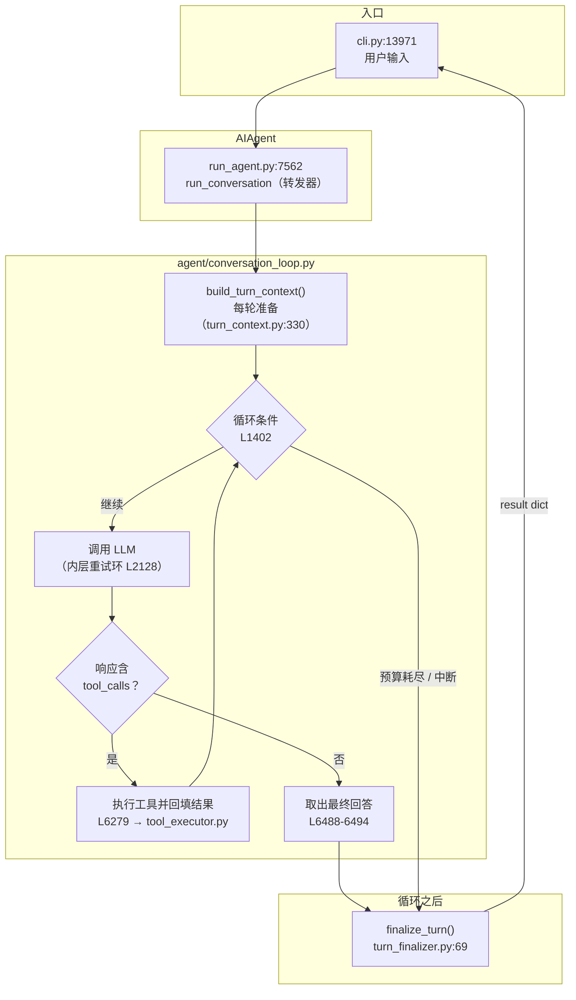
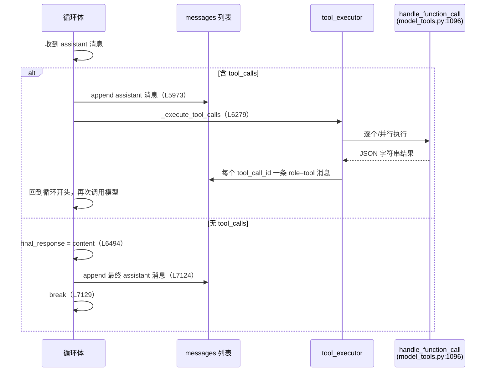

## Agent Loop 是什么

大语言模型本身只能接收文本、生成文本，它不能读取文件、执行命令，也没有跨请求的记忆。要完成非文本生成类任务，须由外部程序承担其余工作：解析模型输出中的工具调用请求，实际执行，将结果写回对话历史并再次提交给模型；如此重复，直至模型不再请求工具并给出最终回答。上述「调用模型 → 执行工具 → 结果回填 → 再调用模型」的循环即 agent loop，是各类 agent 框架共有的核心结构。框架之间的差异不在循环本身（通常只是一个 while），而在循环外围的工程处理：如何防止循环失控、如何处理网络与模型异常、如何在上下文超限时压缩历史、如何响应用户的实时中断。

本文按 Hermes 的实现追踪该循环：用户消息从何处进入，每一圈执行哪些步骤，在何种条件下继续或退出，以及退出之后还须完成哪些收尾。

## 从入口到循环：调用链

Hermes 有多个用户入口（命令行、消息平台网关、TUI、定时任务等），最终汇聚到同一个函数。以命令行为例，交互式 CLI 收到用户输入后调用 `self.agent.run_conversation(...)`（`cli.py:13971`）。`AIAgent.run_conversation`（`run_agent.py:7562`）现仅为转发器（docstring 写作 "Forwarder"），真正的实现是模块级函数 `agent/conversation_loop.py::run_conversation()：1228`。

仓库根目录的开发文档 `AGENTS.md` 至今仍写核心循环位于 `run_agent.py`。官方文档的 Agent Loop 页同样把循环画在该万行文件中，属于文档滞后，本文以源码为准。

执行路径骨架如下图。后文各节按图中顺序展开。




## 进入循环之前：每轮的准备工作

`run_conversation()` 在进入 while 之前，先集中执行「每轮只做一次」的准备工作。该段原先内联在函数中，现已抽取为 `build_turn_context()`（`agent/turn_context.py:330`，调用点在 `conversation_loop.py:1297`）。职责：标准输出保护、重试计数器复位、用户消息清洗、系统提示词的恢复或构建、超限时的预压缩、插件的 `pre_llm_call` 钩子、外部记忆预取，以及为进程崩溃恢复所做的持久化。

对循环而言，这一步的关键产物有二。其一是 `messages`：本轮对话的完整消息列表（OpenAI 消息格式，`system` / `user` / `assistant` / `tool` 四种角色）。其二是一组循环要读写的本地计数器（`conversation_loop.py:1338-1347`）：`api_call_count` 记录本轮已发出的 API 调用数，`final_response` 存放最终回答（初始为 None，被赋值通常意味着循环即将结束），以及中断、失败、压缩尝试次数等标志。准备工作中还有一层进程级 IO 防护：`_install_safe_stdio`（`agent/process_bootstrap.py:204-209`，初始化时 `agent_init.py:571` 也会调用一次）用 `_SafeWriter`（63–80 行）包装 stdout/stderr。systemd、Docker 或子代理线程拆除时，管道可能已经断开，`print` 会抛出 `OSError` / `ValueError`；包装后视为写入成功，以免 except 中再次 print 造成二次崩溃。循环运转并不依赖该路径，但它使日志管道故障不至于导致本轮对话中止。

平台差异也不进入循环体。`AIAgent` 构造时挂上一组回调（`agent_init.py:477-488`，赋值在 741–757 行）：工具进度、思考指示、推理文本、流式 token、clarify / 审批、每步结束、状态变更。CLI 用它们驱动 spinner 和 prompt_toolkit；网关用它们发送进度消息；ACP 用它们更新 IDE。循环只在固定时机调用，自身不判断当前入口是 Telegram 还是终端。去掉回调，循环仍可跑完，入口则失去实时可见性。

`turn_context.py:492` 处还有一处与预算作用域相关的赋值：

```python
# agent/turn_context.py:492
agent.iteration_budget = IterationBudget(agent.max_iterations)
```

每轮开始时，迭代预算被整体重建。因此预算的作用域是「一轮用户消息」，不跨轮累计：用户每发送一条新消息，计数从零开始。

## 循环的继续与终止

主循环从 1402 行开始：

```python
# agent/conversation_loop.py:1402
while (api_call_count < agent.max_iterations and agent.iteration_budget.remaining > 0) or agent._budget_grace_call:
```

条件中出现三个量，分述如下。

### 双计数器：max_iterations 与 IterationBudget

`api_call_count < agent.max_iterations` 限制本轮的 API 调用总数。`AIAgent` 构造函数的形参默认是 90（`run_agent.py:446`）；命令行和 TUI 实际传入的是 `agent.max_turns`，配置默认 500（`config_defaults.py:32`，CLI 传入 `cli_agent_setup_mixin.py:478`）。该上限针对模型陷入无法收敛的工具调用循环，例如反复读取同一文件、反复执行同一命令，定位为最后防线而非日常约束。

`agent.iteration_budget.remaining > 0` 读取上一节所述的 `IterationBudget`（`agent/iteration_budget.py:17`），即带线程锁的消耗/退还计数器。循环体每圈开始时调用 `consume()` 扣减一次（`conversation_loop.py:1433`），扣减失败即退出循环。该计数器每轮重建，上限又与 `max_iterations` 相同，之所以独立于 `api_call_count`，在于**退还（refund）机制**：某些迭代不应计入预算。典型情形是 `execute_code`（程序化工具调用）——当一次响应里模型只调用了 `execute_code` 时，本次迭代的预算会被退还（`conversation_loop.py:6326-6331`），因为这类调用是廉价的本地 RPC，不应消耗模型的思考额度。此外，多个错误恢复路径（如 API 断连重试、压缩后重发）也会退还预算并回退计数（1902-1905、2057-2060、5556-5557 等处），使一次失败的尝试不占用额度。带锁的实现还使其可被其他线程安全读取；收尾阶段的诊断信息即直接读取它的 `used` / `max_total`（`turn_finalizer.py:435-436`）。

### 休眠的 grace call

第三个量 `agent._budget_grace_call` 通过 `or` 连接在条件之外，循环体内也有配套的消费逻辑：若该标志为真，跳过预算扣减并复位标志，使循环在预算耗尽后再跑一圈（1431-1432 行，注释称之为 grace call）。但在当前版本的全部源码中，**没有任何生产代码把这个标志置为 True**（它只在 `agent/agent_init.py:879` 被初始化为 False）。因此这是一段处于休眠状态的机制：意图（预算耗尽后给模型一次收尾机会）写在注释里，触发路径却不存在。同一段初始化注释还写明：中间档的预算压力警告已经移除，因为模型会在复杂任务上提前放弃（#7915，`agent_init.py:872-877`）。官方压缩文档同样记录了这次删除。阅读时须把注释中的意图与实际接线分开核对。

### 中断与不可恢复错误

除 while 条件外，循环还有两处提前退出。一是用户中断：循环体开头检查 `agent._interrupt_requested`（1417-1422 行），命中则设置 `interrupted = True` 并 break。检查放在每圈最前，以保证中断在下一次昂贵操作（API 调用）发生前生效；若中断到达时模型请求正在途中，另有独立出口在请求返回处处理（5563 行，退出原因记为 `interrupted_during_api_call`）。二是不可恢复的错误路径，例如会话持久化失败（6285 行）、工具护栏强制停止（6292 行）、重试耗尽（5618 行）等。循环用诊断变量 `_turn_exit_reason` 统一记录每种退出原因，该变量同时构成一份退出路径清单。


进入循环体后，每一圈分为三步：将 `messages` 加工成本次请求的载荷，发出请求并取得响应，再根据响应内容选择分支。

### 构建 api_messages

第一步是构建 `api_messages`（约 1528-1808 行）。它并非简单复制 `messages`，而是做了一系列修复和适配：修复模型生成的畸形工具调用参数（1542 行，实现是 `message_sanitization._repair_tool_call_arguments`），以及工具**名**与注册表不符时的另一条路径——`repair_tool_call`（转发器 `run_agent.py:4615`，实现 `agent/agent_runtime_helpers.py:3019-3038`）。名字修复按顺序做小写直配、连字符/空格改下划线、CamelCase 转 snake_case、去掉模型常加的 `_tool` 后缀，最后才使用 `difflib`（cutoff 0.7）。注释指向真实事故：`TodoTool_tool`、`Patch_tool` 曾直接报 Unknown tool（#14784）。参数修复和名字修复不是同一条函数。随后为参数校验严格的提供商清洗工具调用结构（1654-1676 行）、合并相邻的同角色消息、把工具调用规范化为跨提供商一致的形态（1808 行调用 `_canonicalize_api_tool_calls`）。这一层对应一个工程事实：不同推理提供商对 OpenAI 消息格式的实现宽严不一，直接把内部消息原样发出，在不少后端上会被拒绝。

### 发出请求：重试、备援、流式

第二步是发出请求。请求外层包着一个重试环（`while retry_count < max_retries`，2128 行），处理限流、超时、上下文超限等可恢复错误；实际调用封装为 `_perform_api_call`（2370 行），经 `run_llm_execution_middleware` 中间件包裹后执行（2417 行）。重试仍无法通过时，`try_activate_fallback`（`agent/chat_completion_helpers.py:1695-1717`）按初始化时记下的 `_fallback_chain` 原地换成下一个提供商的 client / model / provider，然后继续同一条重试环。链走完返回 False。因 429 / 计费离开**主**提供商时会先打 60 秒冷却，避免下一轮立刻跳回已经空的桶。流式路径是默认的：即使没有 `stream_callback` 也优先 `_interruptible_streaming_api_call`（2316–2326、2379 行），因为非流式连接可被提供商用 SSE ping 无限挂起，而流式路径带 90 秒无 chunk 判定死连接、60 秒读超时。没有消费者时回调为空操作；提供商不支持流式再退回非流式。重试分类、提供商故障转移、上下文压缩自救足够单独成文；就循环而言，这一步的产出是一条 assistant 消息，其中要么含 `tool_calls`，要么只有文本内容。

主循环这一步使用当前会话的主模型，不会按本步难易临时更换便宜模型。压缩摘要、视觉、网页抽取、技能 Hub 检索这类侧任务走另一条解析链：`auxiliary_client.call_llm`（`agent/auxiliary_client.py:8439`）。auto 模式下按主提供商 → OpenRouter → Nous Portal → 自定义 endpoint → 原生 Anthropic → 若干直连密钥的顺序查找可用后端（模块文档 7–15 行）；每个任务可在 `auxiliary.<task>` 中单独覆盖提供商和模型。402 / 欠费会自动尝试链上下一个。

### 有无 tool_calls

第三步是分派。响应的处理是一个大分支（5886 行起）：




## 有工具调用时：执行与结果回填

当响应携带 `tool_calls`，循环先把这条 assistant 消息原样追加进 `messages`（5973 行）。**先入列、后执行**是协议要求：OpenAI 格式规定每个 `tool_call_id` 必须有一条对应的 `role="tool"` 结果消息紧随其后；先记录请求，才能保证后续无论执行成败，历史都能配对完整。

### 并行切分与中断

执行本身委托给 `agent._execute_tool_calls`（调用点 6279 行，实现在 `run_agent.py:7396`）。它按批次形态选择策略：单个调用走顺序执行；多个调用先切分段落，可并行的段落并发执行，其余顺序执行（`run_agent.py:7411-7435`）。切分规则在 `agent/tool_dispatch_helpers.py`：`clarify` 这类交互工具整段降为串行（`_NEVER_PARALLEL_TOOLS`，44 行）；只读白名单（`read_file`、`web_search` 等，`_PARALLEL_SAFE_TOOLS` 47–59 行）可以并行；`read_file` / `search_files` / `write_file` / `patch` 按路径是否冲突决定——读者与读者重叠仍可并行，任一写入与重叠路径冲突则在该处切断，后一段等前一段跑完（61–71、127–142 行）。白名单外、也未声明可并行的 MCP 工具同样成屏障。并行工人数 `min(本段工具数, 8)`（`tool_executor.py:95, 925`）。结果按模型给出的原始顺序写回，不按完成先后。串行路径每执行完一个工具都检查 `_interrupt_requested`，命中则跳过剩余调用并补 `[Tool execution skipped]` 的 tool 消息，保证每个 `tool_call_id` 仍有配对（1989–2006 行）；并行段一旦 `submit` 就无法按工具取消，所以只在入口做一次中断检查。

三种执行器都实现在 `agent/tool_executor.py` 中（顺序版定义于 1335 行），最终都调用 `handle_function_call`（`model_tools.py:1096`）——即工具注册表的统一分发入口。对循环而言，每次工具执行的结果是一条 `role="tool"` 的消息（内容为 JSON 字符串），由执行器直接追加进 `messages`。

### 超大结果落盘

工具结果本身还有三层体积防御（`tools/tool_result_storage.py:1-23`），避免一次 `search_files` 将上下文窗口撑满。第一层由工具自行截断；第二层 `maybe_persist_tool_result`（144 行）在单条结果超过该工具登记的 `max_result_size_chars` 时，把全文写进沙箱临时目录（Linux 上常见为 `/tmp/hermes-results/{tool_use_id}.txt`），上下文里只留预览和路径，模型需要时再 `read_file`；第三层 `enforce_turn_budget`（203 行）在本轮所有 tool 消息收齐后，若合计超过约 20 万字符，把尚未落盘的最大几条再溢到磁盘。顺序与并行两条执行器在收尾处都会调用第三层（`tool_executor.py:1304, 2014`）。

工具执行完成后、回到循环开头之前，还有一次上下文体检（6333-6389 行）：用 API 响应报告的真实 token 用量（不是本地估算）判断是否需要压缩历史。这里的注释解释了取舍：只看 `prompt_tokens` 不算推理型模型灌水的 `completion_tokens`，避免过早触发压缩；压缩尝试次数受 `max_compression_attempts`（默认 3，1354 行）限制，防止压缩本身陷入循环。

### 协议补位

异常路径也需说明。整个循环体外面套着一个大的 try/except（7131 行起），它做了两件在其他框架中较少见到的事。其一，按 traceback 经过的模块把异常分为「API 错误」与「本地处理错误」——后者是确定性 bug，重试只会消耗预算，因此立即终止而不重试（7150-7224 行，注释引用了修复它的 issue #66267）。其二，如果异常发生时已有 assistant 消息带着未应答的 `tool_calls` 入列，异常处理器会为每个缺失的 `tool_call_id` 补一条错误内容的 `role="tool"` 消息（7178-7200 行）：回填错误结果，以免消息历史出现协议残缺，否则下一次 API 调用会被提供商直接拒绝。

## 没有工具调用时：最终回答

当响应不含 `tool_calls`，循环认定这就是最终回答（6488-6494 行）：

```python
# agent/conversation_loop.py:6488-6494（节选）
else:
    # No tool calls - this is the final response.
    final_response = assistant_message.content or ""
```

在真正退出前还有一串校验与补救（空响应恢复、被截断响应的续写、对"叙述完成但未验证"的回答的验证门控等），它们都可能把 `final_response` 清空并 `continue` 回循环再跑一圈。全部通过后，最终消息入列，退出原因记为 `text_response`，循环结束（7124-7129 行）。

## 循环之后：finalize_turn 与预算耗尽的收尾

循环退出并不等于函数返回。所有退出路径最终汇聚到 `finalize_turn`（调用点 7229-7246 行，实现在 `agent/turn_finalizer.py:69`），由它组装并返回结果字典（`final_response`、完整 `messages`、API 调用数、完成/失败标志等）。

预算耗尽时的用户体验在此处理。如果循环因预算耗尽退出且 `final_response` 仍为 None——即模型的工作在中途被切断——`finalize_turn` 会调用 `_handle_max_iterations`（`turn_finalizer.py:127-142`，实现在 `agent/chat_completion_helpers.py::handle_max_iterations`）：注入一条请求总结的用户消息，并发出**一次不携带工具的额外 API 调用**，让模型把已完成的部分整理成可交付的回答。用户最终收到的是「哪些已完成、哪些未完成」的说明，而非不完整的工具调用中间状态。这与 while 条件里休眠的 `_budget_grace_call` 意图相同，只是当前版本选择在循环之外实现。

回答已经交给用户之后，`finalize_turn` 还可能再开一条与主循环无关的路径：若本轮工具迭代次数达到技能 nudge 间隔、或本轮用户消息计数达到记忆 nudge 间隔，并且对应工具仍在 `valid_tool_names` 里，就调用 `agent._spawn_background_review`（判定在 `turn_finalizer.py:698-724`，线程构造在 `run_agent.py:1792-1808`）。中断轮次或没有 `final_response` 时不 spawn。fork 出去的审查 Agent 不往父对话插消息，主循环的角色交替和前缀缓存不受影响。

## 文档与源码对照

严谨起见，将本文核实过程中发现的五处「注释/文档与代码行为不一致」单独列出。它们不影响上文结论（上文均以实际代码行为为准），但自行阅读源码时可能被这些文字误导。

其一，`agent/agent_init.py:575-576` 的注释称迭代预算"parent creates, children inherit"（父建子承）。但委派子代理的实际代码显式传入 `iteration_budget=None` 并注明 "fresh budget per subagent"（`tools/delegate_tool.py:1544`），`IterationBudget` 自身的 docstring 也明确每个子代理拥有独立预算、上限来自 `delegation.max_iterations`（默认 50）。以委派代码为准：预算不共享。

其二，`_budget_grace_call` 具备完整的条件判断与消费逻辑（`conversation_loop.py:1402, 1431-1432`），但全仓库不存在将其置 True 的生产代码。这可能是之前演化残留。

其三，`auxiliary_client.py` 模块文档仍把 session search 列为 auxiliary 消费者（1–5 行）。`DEFAULT_CONFIG` 写明 `auxiliary.session_search` 已删除，该工具直接返回库内容（`config_defaults.py:888-891`）。以配置为准。


## 小结

Hermes 的 agent loop 是一个完全同步的 while 循环。骨架为：检查预算与中断，构建请求，调用模型，然后二选一——执行工具并回填结果后再来一圈，或者取出最终回答退出。围绕该骨架，代码处理了四类问题：用双计数器加退还机制约束循环规模（预算耗尽后还有一次去工具的总结调用兜底）；把中断检查放在每次昂贵操作之前，串行工具批次还能在工具之间停掉剩余调用；以「先入列后执行、异常时补位」维持消息协议完整；用真实 token 用量驱动上下文压缩，并用落盘预览限制单条过大的工具结果。请求默认走流式路径，以便发现「连接仍在、数据不来」的假活。工具名不符时先走 `repair_tool_call`，避免一次拼写错误直接变成 Unknown tool。主循环不按步更换模型；压缩和视觉走 `auxiliary_client` 的独立解析链。循环退出并交付回答之后，nudge 计数达到阈值才会 fork 后台审查，不插入正在运行的 messages。循环体本身约 5800 行，其中骨架只占很小一部分，其余几乎全部是对失败路径的处理。这个比例说明一个问题：agent 框架的工程复杂度主要集中在失败路径，循环骨架本身并不复杂。
