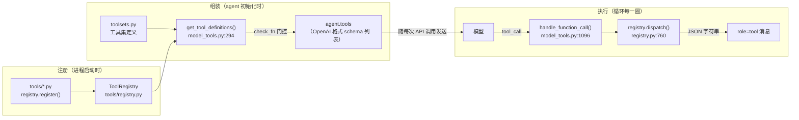
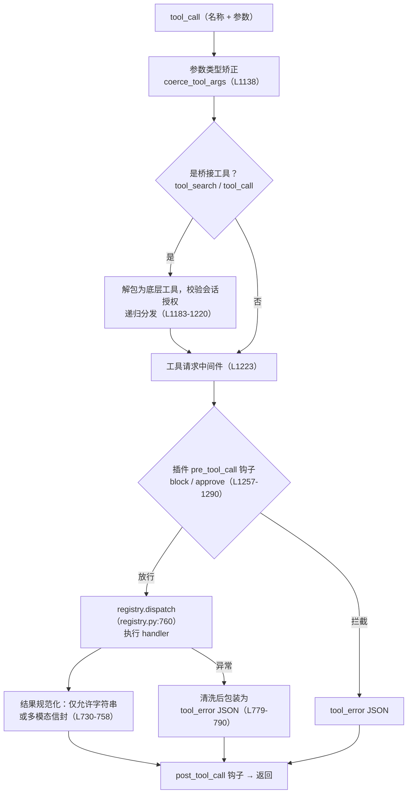

## 模型如何看见工具

上一篇写到，agent loop 的每一圈都会发出一次 API 调用，模型的响应里可能携带工具调用请求。前提是：模型并不天然知道有哪些工具可用。每一次 API 请求都须附带一份完整的工具清单——每个工具的名称、功能描述、参数的 JSON Schema——模型依照这份清单选择调用。

该机制决定了工具系统的成本结构：**清单中的每一个工具，都在每一次 API 调用中消耗 token**。若一个 agent 携带 50 个工具，每次请求须先付出两三万 token 的 schema 开销，再开始处理正题。Hermes 工具系统中工具集过滤、可用性门控、多层缓存、以及将某些能力排除在核心清单之外，均可由此解释：控制清单大小，并保证它在会话期间稳定（稳定性关系到提示词缓存，第 4 篇展开）。

项目文档 `AGENTS.md` 将这一取向概括为「窄腰」（narrow waist）：核心工具清单是整个系统最昂贵的表面，新能力应尽量以别的形态接入——扩展现有代码、CLI 命令加技能、条件门控工具、插件、MCP 服务器，实在不行才新增核心工具。这是项目声明的设计意图；本文说明它在代码中如何落实。

本文按一个工具的生命周期展开：如何注册进系统、如何被组装进发给模型的清单、模型调用时请求如何被分发执行、结果以何种契约返回。

## 注册：导入即声明

Hermes 的工具没有中央清单文件。每个工具是 `tools/` 目录下的一个 Python 文件；模块被导入时，文件顶层的 `registry.register(...)` 调用把自己声明进中央注册表（`tools/registry.py` ）。注册内容是一个 `registry.py:160-189` 的 `ToolEntry`：工具名、所属工具集、发给模型的 schema、执行调用的 handler，以及若干后文会用到的字段——可用性检查函数 `check_fn`、依赖的环境变量、是否异步、结果大小上限。

「导入即注册」须解决一个前提：如何保证所有工具文件都被导入。答案是自动发现（`discover_builtin_tools`，`registry.py:67` ）。它扫描 `tools/`下的每个 `.py` 文件，用 AST 解析判断模块体里是否存在顶层的 `registry.register()` 调用（`registry.py:30-64` ）。判断依据是语法树而非文本匹配，因此写在函数内部的注册调用不会被误认；判定为工具模块的才执行导入。为降低启动成本，每个文件的判断结果以 `(mtime, size)` 为键缓存在磁盘上（`registry.py:70-75` ），文件未变则不重新解析。新增工具因此不需要改任何注册清单，把文件放入目录即可；但它是否**暴露给模型**是另一回事，见下一节。

注册表还处理多方共存时的重名：内置工具、插件工具、MCP 工具都注册进同一张表。默认规则是跨工具集的同名注册直接拒绝；插件若要替换内置工具（例如更换浏览器后端），需要代码侧 `override=True` 加用户配置侧 `allow_tool_override` 双重明示（`registry.py:536-581` ）。注销接口受同样的策略约束，否则插件可以先注销再注册，绕过覆盖检查。

依赖方向也需说明：`registry.py` 是一个不依赖任何业务模块的叶子，工具文件依赖它，`model_tools.py` 再依赖工具文件（模块 docstring `registry.py:1-15` 画出了这条链）。因此「导入即注册」不会形成循环导入；循环导入是注册表模式实现中的常见错误。

## 组装：从注册表到发给模型的清单

注册进表不等于模型能看到。发给模型的清单在 agent 初始化时组装（`agent/agent_init.py:1419-1423` ）：以启用/禁用的工具集列表为参数调用 `model_tools.py:294` 的 `get_tool_definitions()`，结果存为 `agent.tools`，此后随每次 API 调用发送。

组装分两步。第一步由 `toolsets.py` 回答「这个场景应有哪些工具名」：`TOOLSETS` 字典定义了 `web` 、`terminal` 、`file` 等几十个工具集，工具集可以包含具体工具也可以嵌套引用其他工具集；`toolsets.py:31-86` 的 `_HERMES_CORE_TOOLS` 是 CLI 和所有消息平台共享的核心清单。**工具必须属于某个工具集才可能暴露给模型**（`model_tools.py:303` ）。自动发现负责「知道它存在」，进入工具集才是「决定给模型看」，两步分开，后者为人工决策。核心清单里有一处注释直接展示了窄腰原则的执行：桌面端的 `project_`* 工具虽然存在，却被排除在核心清单外，只在 GUI 网关的专属工具集里启用，注释原文即 "narrow waist"（`toolsets.py:60-64` ）。

第二步由注册表回答「这些名字里哪些现在真正可用」：`registry.py:676` 的 `registry.get_definitions()` 逐个工具执行 `check_fn`，失败的工具**直接不出现在 schema 里**——模型根本不知道它存在。此即 Hermes 的「条件门控工具」机制：Home Assistant 工具只在配置了令牌时存在，Docker 终端后端只在 Docker 探测通过时存在。对模型而言没有「不可用的工具」，只有「不存在的工具」，从而避免模型对着一个必然失败的工具反复尝试。

门控函数探测的是外部状态（Docker 守护进程、SDK 安装、浏览器二进制），不能每次组装都实际探测一遍，所以结果带约 30 秒的 TTL 缓存。缓存之上还有一层抖动抑制，其注释（`registry.py:203-210` ）记录了一次真实事故：一次 `docker version` 探测在高负载下超时返回 False，恰好撞上一个委派子代理的初始化，导致整个 terminal + file 工具集被静默剥离，子代理报出 "Tool read_file does not exist"。修复方式是记住每个检查上次成功的时间，距上次成功很近的失败不采信。门控决定模型可见的工具集合；探测的瞬时抖动会表现为该集合的突变，因此必须做平滑。

`get_tool_definitions` 自身还有一层记忆缓存（`model_tools.py:326-355` ），它的缓存键设计说明了什么会让清单变化：工具集集合、注册表的代数计数器 `_generation` （每次注册/注销递增，`registry.py:603` ）、config.yaml 的修改指纹（有些 schema 字段按运行时配置动态生成，`registry.py:706-721` ），以及是否处于 kanban / 委派上下文。缓存命中和写入都返回浅拷贝：长驻网关进程里共享列表被下游追加污染，工具名重复，被严格校验的提供商以 HTTP 400 拒绝。

## 执行：一次调用的完整流水线

模型的响应里带回 `tool_calls` 后，上一篇写过执行权委托给 `agent/tool_executor.py` ，它最终调用统一分发入口 `model_tools.py:1096` 的 `handle_function_call()`。这个函数的签名承诺了工具系统最重要的契约：**无论发生什么，返回值都是一个 JSON 字符串**。流水线如下：

以下分述主要环节。

### 参数类型矫正

入口处先做参数类型矫正（`model_tools.py:1138` ）：模型经常把数字参数生成为字符串（`"42"` 而不是 `42` ），矫正函数按 schema 声明的类型做转换，把一类高频的模型输出瑕疵挡在所有 handler 之外。

### agent 级工具不走这条函数

分发前有一个例外检查（`model_tools.py:1243-1244` ）：`todo` 、`memory` 、`session_search` 、`delegate_task` 这四个工具如果走到这里，会直接返回错误 "must be handled by the agent loop"。它们是 **agent 级工具**——执行时需要读写 agent 实例的状态（todo 列表存在 `agent._todo_store` 上），而 `handle_function_call` 是无状态的模块函数，拿不到 agent 实例。所以它们在上游的 `tool_executor` 里被拦截，绑定 agent 状态后执行（`tool_executor.py:1433-1439` ）。该错误消息是防御性兜底：正常路径不会触发它。

### 插件钩子

插件的 `pre_tool_call` 钩子（`model_tools.py:1257-1290` ）是外部干预点：插件可以观察每次调用，也可以返回 block 指令拦截它（拦截结果同样以 `tool_error` JSON 返回给模型，并照常触发 `post_tool_call`，保证观察类插件看到完整的调用记录）。注释强调了单次触发契约——一次工具执行，钩子恰好触发一次，无论调用路径从哪里进来。

### 结果必须是 JSON 字符串

真正的执行在 `registry.py:760-790` 的 `registry.dispatch()`：按名字取出 ToolEntry，执行 handler（`is_async`时走 `_run_async`），然后做两件收尾。一是结果契约的强制（`registry.py:730-758` ）：handler 只允许返回字符串或一种明确定义的多模态信封 dict，返回其他任何类型都被替换成错误 JSON。注释说明了理由：下游的日志、钩子、预算、持久化都假设结果可以安全地切片和计量，放入任意类型会在远离故障点的地方出错。二是异常的收容：任何 handler 异常都被捕获，**先经过文本清洗再包装**成 `{"error": "..."}`。清洗针对一个隐蔽问题（`model_tools.py:671-677` 的注释）：异常文本可能携带 `</tool_call>` 之类的框架符号，原样进入 tool 消息会被某些模型当成结构标记，破坏后续解析。

### 异步桥接：loop 寿命必须盖过客户端

异步桥接不能每次 `asyncio.run()`。`asyncio.run()`会新建并关掉 event loop，而 httpx / AsyncOpenAI 一类客户端会绑在创建时的 loop 上，GC 时对着已关闭的 loop 清理就会报 `Event loop is closed`。`model_tools.py:103-122` 的 `_run_async`是同步世界调用异步 handler 的唯一入口，分三条路：当前线程已有 running loop（网关、RL 环境）则另开工人线程跑，避免和正在转的 loop 冲突；工人线程（并行工具、子代理）用 `threading.local`上的持久 loop（`_get_worker_loop`，`model_tools.py:81-100` ），因为 `run_until_complete`不是线程安全的，不能和主线程共用一个 loop；CLI 主线程用进程级 `model_tools.py:66-78` 的 `_tool_loop`，活到进程退出。原则是：loop 的寿命必须盖过绑在它上面的异步客户端。

### 读循环计数与桥接越权

分发里还有一个读循环计数器。连续的 `read_file`/ `search_files`会被 `file_tools`记成同一任务上的 consecutive 次数，防止模型对同一批文件做无效重复读取。任何**其他**工具跑过之后，`handle_function_call`调用 `notify_other_tool_call`（`model_tools.py:1306-1313` ，定义于 `file_tools.py:1603-1610` ）把计数清零——中间夹了一次写入或终端命令，下一次读取算新的。`execute_code`另有一条：沙箱里要生成「当前会话有哪些工具」的引用，优先用调用方传入的 `enabled_tools`，而非进程全局 `_last_resolved_tool_names`，避免子代理把父代理的工具面写丢（`model_tools.py:1336-1339`）。

## 沙箱、审批与写路径闸

### 换后端不换工具名

`terminal` 工具并不绑死本机 shell。`tools/environments/` 里每个后端实现同一份 `BaseEnvironment`：本机、Docker、SSH、Singularity、Modal（含 Nous 托管模式）、Daytona、Vercel Sandbox（`tools/environments/__init__.py:1-9` ）。选哪一个由终端配置决定，模型看到的仍是同一个 `terminal` schema——这是窄腰的又一次应用：换执行隔离域，不换工具清单。

### 危险命令：正则表 + tirith，一次审批

真正执行命令之前，危险模式要过 `tools/approval.py` 。这个模块是检测、会话态、CLI/网关提示、辅助模型 Smart Approval 和永久 allowlist 的单一入口（`tools/approval.py:1-8` ）。`DANGEROUS_PATTERNS`覆盖递归删除（包括 flags 写在路径后面的 GNU `rm`）、Windows `cmd`/ PowerShell 的删除动词、`chmod 777`一类（`tools/approval.py:692` 起）。`tools/approval.py:3532-3544` 的 `check_all_command_guards`把这张表和 tirith 的内容级扫描合成**一次**审批：tirith 看的是同源字符 URL、管道进解释器、终端注入这类，不在正则表里的威胁（`tools/tirith_security.py:1-21` ，`check_command_security`在 `tools/tirith_security.py:731` ）。`security.tirith_enabled`默认 True（`config_defaults.py:2134` ）；扫描失败时 `tirith_fail_open`默认 True，避免二进制损坏把每一次 terminal 都卡死（tirith_security.py:748-754，issue #41400）。两条检查一起出示，是为了防止网关 `force=True`重放只过了其中一道。`HERMES_YOLO_MODE`在模块 **import 时**写成冻结布尔值（`config_defaults.py:32-35` ）：注释写明，如果每次调用再读环境变量，技能可以在进程里把这个变量设上，整段审批就被绕过。子代理工人线程拿不到 CLI 的交互回调，默认 auto-deny，走的是同一套检测表。

### 工作区 checkpoint（默认关）

写文件还有一层工作区快照，模型不可见。`CheckpointManager` （`tools/checkpoint_manager.py:1-12, 701-707` ）在共享的影子 git 库里给工作目录拍照，对象按内容去重。agent 初始化时构造它（`agent_init.py:1547-1552` ）。`write_file`/ `patch`执行前对目标路径所属项目根调用 `ensure_checkpoint`（`tool_executor.py:604-613, 60-75`）；`terminal`仅当命令被判定为破坏性时才拍照（`agent_init.py:615-624` ）。每个目录每圈最多一次，去重集合在循环开头 `new_turn()`清空（第 2 篇）。默认 `checkpoints.enabled`为 **False**（`config_defaults.py:413-424` ）：v2 从默认开启改为需显式打开，注释写大多数用户从来不用 `/rollback`。打开之后，可以回到本圈第一笔写入之前的工作区状态，而不是把整段对话轨迹序列化成可 resume 的 JSON。

### 回给模型之前先脱敏

工具结果回给模型之前还会剥一层密钥。`agent/redact.py:659-672` 的 `redact_sensitive_text` 用正则遮盖 API key、token、私钥；`security.redact_secrets` 默认 True（`config_defaults.py:2133` ）。terminal、`read_file` 、code execution、网关展示各自在出口调用（例如 `file_tools.py:1337` 、`terminal_tool.py:3051` ）。`force=True` 的调用不受用户关闭脱敏的影响。这与记忆写入闸不同：MemoryStore 另有注入扫描。

### 写路径拒绝与跨 profile 软闸

`write_file`/ `patch`还有一层路径闸。`agent/file_safety.py:28-61` 的 `build_write_denied_paths`列出不能写的精确路径：用户 `.ssh` 下的密钥和 config、当前 profile 与默认根上的 `.env` 和 Anthropic OAuth 文件、`.netrc`/ `.pgpass` 等。跨 profile 写 `~/.hermes/profiles/other/skills/` 这类目标会先给出软警告，调用方加 `cross_profile=True` 才能继续（`file_tools.py:758-787` ）。闸的目的是挡住模型工具调用的误伤。

### ContextEngine 与 MemoryProvider 不进 registry

分发在 `tool_executor` 里也不止 registry 一条路。除第 2 篇说过的 agent 级工具外，若名字落在 `agent._context_engine_tool_names`，走当前 ContextEngine 的 `tool_executor.py:1607` 的 `handle_tool_call`；若 `MemoryManager.has_tool`为真，走外部记忆提供商自己的工具（`tool_executor.py:1642-1656` ，注释举例 `hindsight_retain`、`honcho_search`），这些名字不在 ToolRegistry 里。其余才是 `handle_function_call`→ `registry.dispatch`。

## 小结

Hermes 工具系统的骨架是经典的注册表模式：导入即注册、按需组装、统一分发。与常见注册表实现的差别，来自三项生产约束。第一是成本：schema 随每次 API 调用计费，于是有工具集过滤、check_fn 门控（不可用即不存在）和窄腰原则——连 desktop 专属工具都要从核心清单中排除。第二是稳定性：门控探测会抖动、缓存共享会被污染、异常文本会破坏消息框架，于是有 TTL 加抖动抑制、浅拷贝防御、错误文本清洗。第三是边界：插件、子代理、桥接机制都可能越权，于是覆盖要双重明示、注销受同样管制、桥接调用要二次校验；终端命令还要过 import 时冻结的 YOLO 开关、`DANGEROUS_PATTERNS` 和 tirith 的内容扫描，写文件还要过敏感路径与跨 profile 软闸，以及默认关闭的工作区 checkpoint；回给模型的文本会先脱敏。换 Docker / SSH / Modal 只换 `BaseEnvironment`，不换模型眼前的工具名。MemoryProvider 和 ContextEngine 的工具在 `tool_executor` 里提前分流，不进 ToolRegistry。完成「分发」本身的代码只占少数，多数代码用于守护这三类约束。
