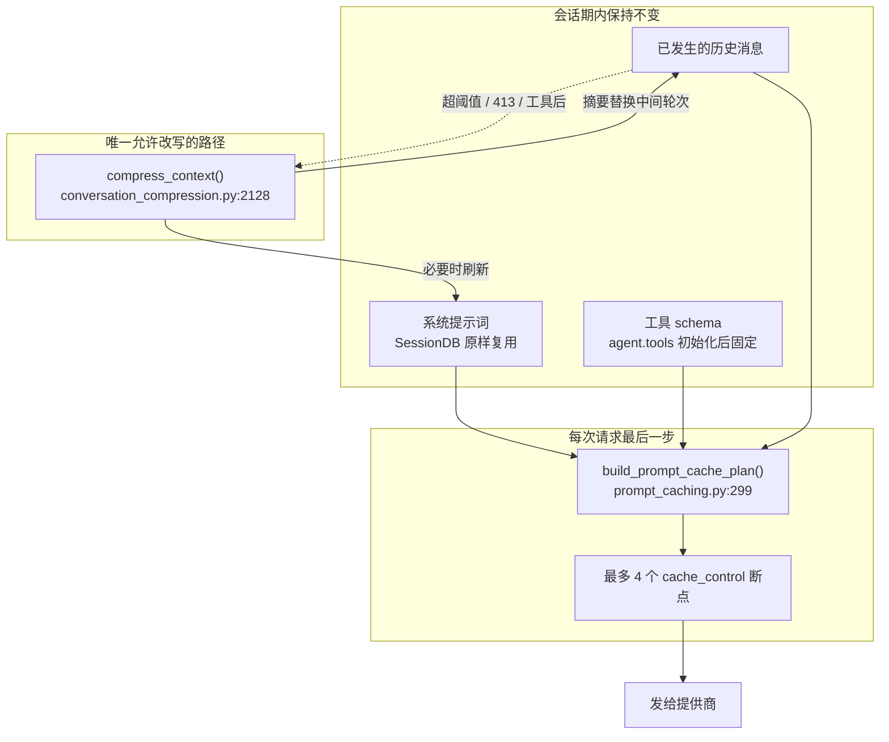
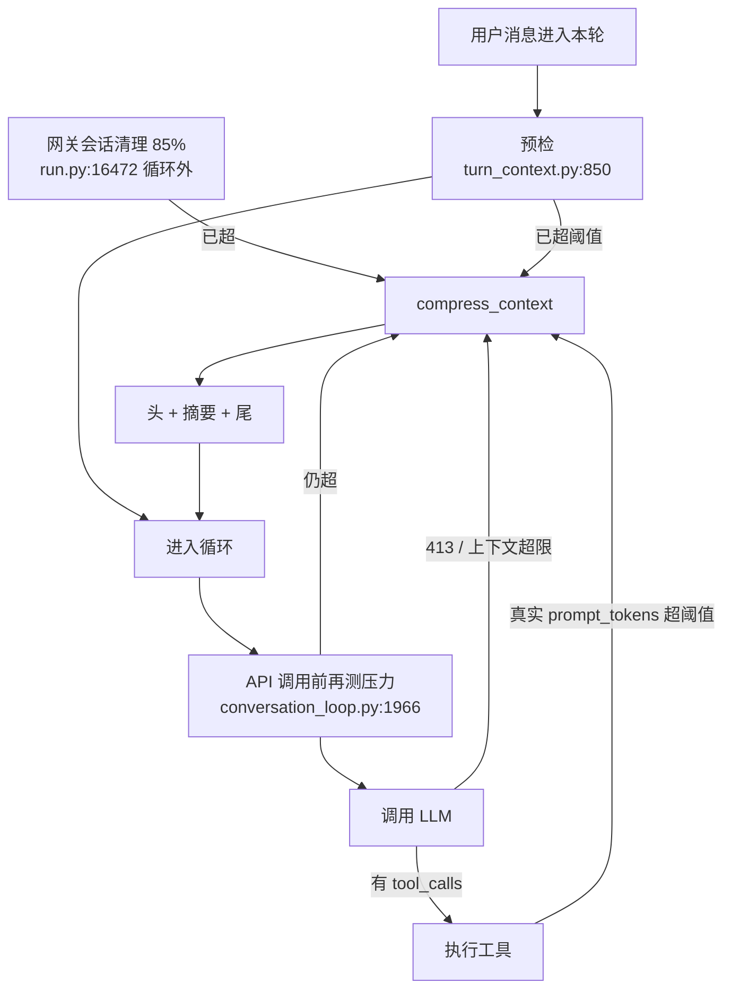

## 提示词缓存是什么

大语言模型的 API 按输入 token 计费。一次多轮对话里，系统提示词、工具 schema、已经发生过的历史，每一轮都会原样再发一遍。如果提供商能识别「这次请求的前缀和上次完全一样」，就可以复用已经算过的 KV 缓存，只对新增的尾巴计费。Anthropic 把这个机制做成显式的 `cache_control` 标记：调用方在消息上打最多四个断点，提供商在断点处切开缓存块。命中条件很严格——前缀必须**逐字节相同**。改一个空格、换一个工具、重建一次系统提示词，整段前缀作废，下一轮按全量输入重新计费。

因此 Hermes 将「系统提示词在会话期内字节稳定」写成硬约束。项目文档 `AGENTS.md:1133-1145` 将其表述为三条禁令：不要中途改历史、不要中途换工具集、不要中途重建系统提示词；唯一允许改写上下文的时机是压缩。本文说明这三条在代码中如何落实，以及那唯一的例外具体如何发生。

缓存默认只对走 Anthropic 协议的 Claude 系模型开启（原生 Anthropic、OpenRouter、以及 `api_mode == 'anthropic_messages'` 的第三方网关），由 `_anthropic_prompt_cache_policy()` 在初始化时决定（`agent/agent_init.py:831-840` ）。配置项 `prompt_caching.cache_ttl` 可以设为 `5m` 、`1h`，或设为 falsy 值彻底关闭（`agent_init.py:847-868` ）。关闭之后，下文描述的标记逻辑整段跳过，但系统提示词的稳定策略仍然执行——它同时服务于会话恢复。

## 系统提示词：一次构建，整段会话复用

### 从 SessionDB 复用，而不是重建

循环进入之前，`build_turn_context()` 会调用 `_restore_or_build_system_prompt()` （定义于 `conversation_loop.py:470` ）。它的第一选择不是重建，而是从 SessionDB 把上一轮写下的 `system_prompt` 原样读回来。注释把存储状态分成四类（`conversation_loop.py:478-488` ）：`missing` 是新会话的第一轮，应当构建；`present` 是可用文本，应当复用；`null` 和 `empty` 表示行在、内容不可用——后者几乎一定是上一轮写入静默失败，日志升到 WARNING，因为网关每轮新建一个 `AIAgent`，完全依赖这次往返，DEBUG 级别会让缓存 miss 在生产里看不见（`conversation_loop.py:490-495` ）。

### 运行时身份校验

复用还有一道运行时身份校验 `_stored_prompt_matches_runtime` （`agent/conversation_loop.py:608` 起）：存下来的提示词里，Model / Provider / Platform 等字段必须和当前 agent 一致。工作目录一类字段刻意只从提示词自己的 host-info 块读取，而不是全文扫描——否则用户项目里的 `AGENTS.md` 只要有一行以同样标签开头，就会被当成"运行时身份变了"，每轮都重建，整段会话的前缀缓存全部作废（`agent/conversation_loop.py:627-637` 的注释记录了这个坑）。校验通过后，提示词字节原样装回 `agent._cached_system_prompt`，**不经过** `_build_system_prompt`。

### 三层拼成一个字符串

提示词本身按三层拼出来（`agent/system_prompt.py:152-168` ）。`stable` 是跨会话也尽量不变的身份与操作规范：SOUL.md 或内置身份、任务完成指引、并行工具指引、按需的工具行为引导、技能索引、平台格式提示。`context` 是工作区快照和项目文件（AGENTS.md、`.cursorrules` 等，发现于 `TERMINAL_CWD` ）。`volatile` 是记忆摘要、用户画像、以及一行时间戳。三层拼成**一个**字符串，缓存在 agent 上，会话期内不再按层重渲染（`agent/system_prompt.py:549-562` ）。时间戳只写日期、不写分钟（`agent/system_prompt.py:525-531` ）——精确到分钟意味着同一天里每次恢复都会得到不同字节，缓存必 miss；模型若需要精确时刻，用工具去查。

### SOUL.md 与项目文件不是同一条路

身份和项目上下文走两条加载路径，不是同一个文件。`prompt_builder.py:1986-2011` 的 `load_soul_md` 读 `get_hermes_home()/SOUL.md`，作为 stable 层的第一块；文件不存在或为空则用 `DEFAULT_AGENT_IDENTITY`（`prompt_builder.py:144-152` ，注入点 `system_prompt.py:189-201` ）。AGENTS.md 一类项目文件进 `context`层（`system_prompt.py:17-19` ）。`skip_context_files=True`且未打开 `load_soul_identity`时，连 SOUL 也不读——子代理就是这条路径（第 6 篇）。cron 相反：可以跳过 cwd 里的项目文件，但仍设 `load_soul_identity=True`，保住 HERMES_HOME 里的人格（第 7 篇）。SOUL 加载成功后，`build_context_files_prompt`应带 `skip_soul=True`，避免同一份身份进两次（`system_prompt.py:1989-1991` ）。

### 项目上下文 first-match-wins

项目上下文是 **first-match-wins**，同一次构建只加载一种类型（`build_context_files_prompt`，`prompt_builder.py:2114-2176` ）：先找 `.hermes.md`/ `HERMES.md`（从 cwd 向上走到 git 根，`_load_hermes_md` `agent/prompt_builder.py:2017-2040` ），没有再找 cwd 里的 `AGENTS.md`，再没有是 `CLAUDE.md`，最后才是 `.cursorrules` 与 `.cursor/rules/*.mdc`。`.hermes.md` 会先剥 YAML frontmatter（`_strip_yaml_frontmatter`，`agent/prompt_builder.py:122-137` ），frontmatter 留给以后的配置覆盖，进提示词的只有正文。若工作目录是解析失败后落到 Hermes 安装树里的，默认跳过项目文件，避免桌面端把仓库自己的贡献者 `AGENTS.md`当成用户项目规则（`prompt_builder.py:2147-2168` ，#64590）；显式配置的 cwd 或 CLI 的 `allow_install_tree_fallback=True` 不受这条限制。

### 截断与按工具注入的引导

每份上下文在注入前截断。默认下限 20,000 字符（`CONTEXT_FILE_MAX_CHARS`，`agent/prompt_builder.py:1264` ）；有模型 `context_length`时按窗口的 6% 放大，上限 500,000（`agent/prompt_builder.py:1274-1291` ）。`config.yaml`的 `context_file_max_chars`一律压过动态值（`agent/prompt_builder.py:1294-1312` ）。截断留头部 70%、尾部 20%，中间插一段标记，告诉模型用 `read_file`读全文（`agent/prompt_builder.py:1946-1983` ）。官方 Prompt 组装页把上限写成死的 20k，那是历史下限，不是现行唯一值。

工具相关的散文只在工具真正位于 `valid_tool_names` 中时才注入（`agent/prompt_builder.py:226-245` ）：有 `memory` 才有 MEMORY_GUIDANCE，有 `skill_manage` 才有 SKILLS_GUIDANCE。这既节省 token，也避免模型对照一份「请使用你没有的工具」的说明书做无效尝试。另有一段对所有模型都开启的 `TASK_COMPLETION_GUIDANCE` （`agent/prompt_builder.py:206-213` ，可用 `agent.task_completion_guidance` 关闭）：要求交付物是工具跑出来的结果，而不是计划或伪造输出。

### 按模型的 tool-use 强制

`agent.tool_use_enforcement` 控制另一段更硬的要求：「不要只描述，要真正调用工具」（`agent/prompt_builder.py:263-297` ）。默认 `"auto"`：模型名命中 `TOOL_USE_ENFORCEMENT_MODELS`（`gpt`/ `codex`/ `gemini`/ `gemma`/ `grok`/ `glm`/ `qwen`/ `deepseek`，`prompt_builder.py:326` ）才注入 `prompt_builder.py:309-322` 的 `TOOL_USE_ENFORCEMENT_GUIDANCE`。配置为 true 则所有模型都加，false 则都不加，也可以给一份自定义子串列表。命中之后还按家族追加：Gemini/Gemma 用 `GOOGLE_MODEL_OPERATIONAL_GUIDANCE`，GPT/Codex/Grok 用 `OPENAI_MODEL_EXECUTION_GUIDANCE`。这些块在会话构建时就定死，不随轮次变化。

### 注入扫描

项目文件进系统提示词之前会过 `prompt_builder.py:55-77` 的 `_scan_context_content`：用共享威胁库的 `context`范围做正则扫描，命中则整份内容换成 `[BLOCKED: … potential prompt injection]`，不把原文放进提示词。SOUL.md、AGENTS.md、`.cursorrules` 走同一条扫描。注释写明这里不用 LLM 做语义判断——要确定性、低延迟、且不依赖模型自己守门。开头的 UTF-8 BOM 会先剥掉再扫，避免 Windows 编辑器的编码标记把整份文件误杀。

### 子目录规则跟工具结果走

会话开始之后走进子目录，不会回去改系统提示词。`agent/subdirectory_hints.py:1-11` 的 `SubdirectoryHintTracker` 在 `read_file`/ `terminal`/ `search_files`之后从工具参数里抽出路径，首次进入某目录时加载那里的 `AGENTS.md`/ `CLAUDE.md`/ `.cursorrules` （最多 8000 字符，向上最多走 5 层），把提示**追加到这一次工具结果**上（`tool_executor.py:1210-1217` ，串行路径 `agent/subdirectory_hints.py:1915-1921` ）。agent 初始化时按 `TERMINAL_CWD`构造 tracker（`agent_init.py:2624-2626` ）。模块文档写明这是为了保住前缀缓存：启动时只扫 cwd 的那一种项目文件，子目录规则跟着工具结果走，系统提示词字节不动。`node_modules`、`.git` 、venv 一类目录直接跳过，避免把备份里的副本再灌一遍。

### 平台格式提示

平台格式提示按 `agent.platform` 从 `PLATFORM_HINTS` 取出（`system_prompt.py:433-447` ，字典在 `prompt_builder.py:688` 起），例如 Telegram 能用哪些 Markdown、WhatsApp 不要表格。内置没有的平台可从 `gateway.platform_registry`读插件提供的 hint。用户还可以在 `config.yaml`的 `platform_hints.<platform>`里 `replace`或 `prompt_builder.py:73-119` 的 `append`。这一段仍在 stable 层，会话期内字节不变。

### 静态前缀对不上就退回旧布局

静态前缀 `_cached_system_prompt_static` （即 `stable` 层）不单独落库，只存完整字符串。续会话时用 `system_prompt.py:588` 的 `reconstruct_static_prefix` 按当前输入重算 stable，仅当存下来的全文**以它开头**才采用。这个 `startswith` 闸门保证：技能文件被改过、身份变了，静态前缀对不上，就回退到"整段系统提示词一个断点"的旧布局，**已存提示词的字节一个都不改**（`system_prompt.py:602-608` ）。失败按"这份 stored 文本"记忆，避免重试环每次都重新读盘。

## 四个断点怎么打

标记逻辑是一组无状态纯函数，集中在 `agent/prompt_caching.py` 。`agent/prompt_caching.py:348-393` 的 `apply_anthropic_cache_control`的规则是：

系统消息若存在，先尝试在静态前缀处打一个断点、在完整系统提示词末尾再打一个；剩下的额度（总共四个）打在最近几条**能真正承载标记**的非 system 消息上。没有可用静态前缀时，退回"系统一条 + 最近三条"。`_can_carry_marker` （`agent/prompt_caching.py:72-93` ）决定什么叫"能承载"：在 OpenRouter 这类信封布局上，空内容的 assistant（纯 tool_calls）和空 tool 消息的顶层标记会被提供商忽略，打上去等于浪费一个断点。

工具数组也可以带标记。`build_prompt_cache_plan` （`agent/prompt_caching.py:299-345` ）在原生 Anthropic 且支持 tool-cache 时，把系统侧的第二个断点让给工具列表的最后一项——工具 schema 通常比易变的系统后缀更稳定，把预算花在那里更划算。

循环里真正调用它的位置在构建完 `api_messages` 的**最后一步**（`conversation_loop.py:1825-1857` ）。注释把原因写得很具体：`_apply_cache_marker` 会把字符串 `content` 改写成 `[{"type": "text", ...}]` 块；如果先打标记再做空白规范化，规范化只认 `isinstance(content, str)`，带标记的消息就被跳过。结果是：一条以换行结尾的工具结果，在"最近三条"窗口里带着 `\n` 发出去，滚出窗口后又被剥掉——同一条消息、相邻两轮字节不同，前缀匹配刚好在断点处断开。所以标记必须在所有清洗、合并、孤儿清扫之后进行。

故障转移会换提供商，也就可能换缓存政策。`try_activate_fallback` 会刷新 `_use_prompt_caching`，但重试环里的 `continue`曾经直接复用已经打好标记的 `api_messages`。`conversation_loop.py:1025-1091` 的 `_redecorate_prompt_cache_for_provider`在每次重试开头剥掉旧标记、按当前政策重铺。注释指向 #72626。从缓存-off 的主提供商切到缓存-on 的备援时，还会补一次静态前缀重建（`conversation_loop.py:991-1007` ），否则 `static_system_prefix=None`，静默掉回旧布局。

## 动态内容如何不进系统提示词

动态内容（技能全文、插件上下文、prefetch）如果写进系统提示词，下一轮前缀就变了。下面几条路径都把变化留在历史尾巴或 API 临时层上。系统提示词字节不动。

### 斜杠技能展开成 user 消息

斜杠技能（`/some-skill 做某事` ）需要把整份 `SKILL.md` 交给模型。如果写进系统提示词，下一轮系统前缀就变了，缓存作废。Hermes 的做法是把它展开成一条普通的 user 消息：`agent/skill_commands.py:569-613` 的 `build_skill_invocation_message` 拼出带激活说明的正文，CLI 再把它放进 `cli.py:10474-10481` 的 `_pending_input`，作为下一条用户输入进入循环。系统提示词字节不动，工具清单也不动，只在历史尾巴上多了一条 user——正好落在"最近两条"的断点窗口里，旧前缀仍然命中。

安装、卸载技能会改变**下一轮**系统提示词里的技能目录。默认行为是延迟到新会话再生效；加 `--now` 才立即失效当前缓存（`hermes_cli/skills_hub.py:1900-1909` ，注释写着 "costs more money"）。此即 `AGENTS.md` 所述 cache-aware 斜杠命令模式。

### 插件与 prefetch 共用 sidecar

同一条原则——动态内容不要进入系统提示词——也适用于插件。`pre_llm_call` 钩子可以返回 `{"context": "..."}` 或一段字符串（`hermes_cli/plugins.py:1919-1929` ）。`build_turn_context` 把它收进 `turn_context.py:1051-1067` 的 `plugin_user_context`，再和外部记忆 prefetch 一起交给 `turn_context.py:53-85` 的 `compose_user_api_content`：只拼到本轮 user 消息的 `api_content`sidecar 上，用户原文 `content`不动。循环组装 `api_messages`时用 sidecar 上线（`conversation_loop.py:1686-1689` 的注释写明原因：改系统提示词会打穿缓存前缀）。`plugins.py` 仍写这些注入「永不落库」；实现上 sidecar **会**随消息写入 SessionDB（`turn_context.py:64-69` ），这样下一轮回放的是当时真正发给模型的字节。落库的是 API 副本，不是把插件散文写进用户说的话。

### ephemeral 与 prefill 只在 API 时拼接

还有一层刻意不进 SessionDB 的系统侧文本。`ephemeral_system_prompt` 在拼 `api_messages` 时接到已缓存系统提示词后面（`conversation_loop.py:1681-1698` ），注释写明“API-call-time only (not persisted to session DB)”。网关从 `HERMES_EPHEMERAL_SYSTEM_PROMPT` 或 `agent.system_prompt` 载入（`gateway/run.py:7917-7921` ）；TUI / ACP 也可以在会话上改这一段而不碰 `_cached_system_prompt`。`prefill_messages`是另一条轮次级注入（网关 `_load_prefill_messages`，`gateway/run.py:7883-7914` ）。它们和 prefetch sidecar 的差别是：sidecar 要回放所以落库；ephemeral / prefill 是这一次请求的临时层，存进 DB 会让下一轮的前缀和这次发出去的字节对不齐。

### 技能索引放进 stable 层，全文按需再读

技能进模型还有一条比斜杠命令更常用的路：系统提示词的 stable 层只放**索引**。`agent/prompt_builder.py:1584-1608` 的 `build_skills_system_prompt` 扫本地 `~/.hermes/skills/` 和只读的 `skills.external_dirs`，拼出按分类排列的 name + description；结果带两层缓存（进程 LRU，以及 `.skills_prompt_snapshot.json` 的 mtime/size 清单）。拼好的字符串追加进 `system_prompt.py:321-329` 的 `stable_parts`，因此会话期内这份索引和身份、操作规范一起字节稳定。全文不进系统提示词。模型要用某份 `SKILL.md`或 `references/`里的文件，调 `skills_list`（工具自己的 docstring 称为 progressive disclosure 第一层，`tools/skills_tool.py:786-791` ）或 `tools/skills_tool.py:962` 的 `skill_view`。编码姿态还可以把整类技能降成「只留名字」的一行，名字仍在、描述拿掉，避免索引把窗口占满（`agent/prompt_builder.py:1584-1607` 的 `compact_categories`）。

### 索引过滤与 optional-skills

索引不是把磁盘上每一个 SKILL.md 都列出来。`prompt_builder.py:1537-1564` 的 `_skill_should_show` 按 frontmatter 条件过滤：`fallback_for_toolsets`/ `fallback_for_tools`在对应主工具已经可用时把技能藏起来（它是替补，不是并列）；`requires_toolsets`/ `requires_tools`缺了任一要求则隐藏。条件从 `metadata.hermes`抽出（`skill_utils.py:665-679` ）。平台是另一道闸：`platforms: [macos]`这类列表与 `sys.platform`比较，缺省或空表示全平台兼容（`skill_utils.py:226-271` ）；Termux 上带 `linux`标签的技能仍视为匹配。配置还可以全局 `skills.disabled`，并按平台加 `platform_disabled`（例如 Telegram 去掉只在桌面有意义的技能，`skill_utils.py:420-455` ）。索引的进程缓存 key 含当前平台和 disabled 集合（`prompt_builder.py:1618-1619` ），避免网关同时服务多个平台时串名单。这些过滤只影响**索引是否出现**；注释写明环境类标签不是硬兼容门，显式 `skill_view`/ `--skills`仍能加载（`skill_utils.py:276-281` ）。

仓库里还有一批默认不进索引的技能。`optional-skills/` 随源码发布，但不在 setup 时拷进 `~/.hermes/skills/`，系统提示词里也就看不到它们（`OptionalSkillSource`，`tools/skills_hub.py:3266-3273` ）。用户用 `hermes skills install official/...`装到当前 profile 的 skills 目录之后，才会出现在下一份索引里。这与「模型从一句话里做关键词 / 向量匹配再挑技能」不是同一条路：现行实现是把过滤后的 name + description 放进 stable 层，由模型自己决定要不要 `skill_view`。没有单独的 skill matcher 进程。

### skill_manage 只清索引缓存，不改本会话提示词

`skill_manage` 在 `skill_manage` 工具可见时，还会往 stable 层注入 `SKILLS_GUIDANCE` （`prompt_builder.py:194-207` ，注入点 `system_prompt.py:232-233` ）：复杂任务（5 次以上工具调用）、棘手错误或非平凡工作流结束之后，用 `skill_manage`存成技能；发现技能过时就立刻 `patch`，不要等用户提醒。后半段是压缩把技能正文收成 `[SKILL_PRUNED]`之后必须 `skill_view` 再加载的安全规则。

这里有一处和公开解读常见写法不一致。`skill_manage` 创建/修补成功后会调用 `clear_skills_system_prompt_cache(clear_snapshot=True)` （`skill_manager_tool.py:1582-1587` ，定义于 `prompt_builder.py:1359-1367` ）。它清的是索引的 LRU 和磁盘快照，让**下一次** `build_skills_system_prompt`重新扫描。当前会话已经缓存的 `_cached_system_prompt`不会因此重写——否则本轮后半段的前缀缓存会整段作废。磁盘上的 SKILL.md 立刻可被 `skill_view` 读到；系统提示词里的那一行索引，要等新会话（或压缩触发的重建）才换。公开文章写“创建后立即生效”若是指改当前系统提示词，与这份实现不符。

### ContextEngine 可以换掉默认压缩器

压缩引擎本身也可以换。`agent/context_engine.py` 定义 ContextEngine ABC（`agent/context_engine.py:1-26` ）：决定何时压、怎么压、可选地暴露自己的工具。配置项 `context.engine`，默认 `"compressor"`，同时只激活一个。内置实现就是下文的 `ContextCompressor`。第三方引擎走 `plugins/context_engine/<name>/`，和第 7 篇的插件发现是分开的路径。

## 压缩：唯一允许改写历史的路径

长对话总会把上下文窗口填满。此时必须改历史，否则请求会被提供商以 413 或 context-length 错误拒绝。压缩是文档承认的唯一例外，实现入口是 `agent/conversation_compression.py:2128` 的 `compress_context`。

### 切哪里：保护头、摘要中、保留尾

压缩器默认在上下文窗口的 50% 处触发（`threshold_percent=0.50`，`context_compressor.py:2208` ），给摘要调用和后续对话留余量。头部固定保护系统提示词加最初几条非系统消息（`protect_first_n=3`，`context_compressor.py:2209、4699`）。尾部用 token 预算而不是死数：预算约为阈值 × `summary_target_ratio`（默认 0.20，`context_compressor.py:2211、1568`），同时 `protect_last_n`作下限，避免最近几条全是短确认时尾部过瘦、或全是巨型 tool 结果时尾部过肥。切点还要 `_align_boundary_forward`/ `context_compressor.py:4622,4707` 的 `_align_boundary_backward`对齐到完整的 assistant+tool 组，不能把一对 tool_call / tool_result 从中间切开。

### 两阶段：先剪工具结果，再调辅助模型

`ContextCompressor.compress` （`context_compressor.py:5934-5963` ）的步骤是：先廉价处理过旧的工具结果（不调 LLM）；再按上面的头尾边界切出中间段；用辅助模型把中间轮次收成一份结构化摘要；组装时把头、摘要、尾接起来，并清掉不成对的 tool_call / tool_result。第一阶段 `_prune_old_tool_results` （`context_compressor.py:2732-2761` ）默认把保护尾之外、超过 200 字符的 tool 结果收成一行说明（例如命令、退出码、行数），并去掉重复读取的旧副本，而不是只留一句无信息的占位符。第二阶段走 auxiliary client，不占主模型额度。摘要模板是固定栏目（`context_compressor.py:3672-3708` ）：Goal、Constraints & Preferences、Completed Actions、Active State、Blocked、Key Decisions、Resolved Questions、Relevant Files、Critical Context。第二次及以后的压缩不从零写，而是把 `_previous_summary` 和新增轮次一起交给模型做增量更新（3341、`context_compressor.py:3720-3736` ），避免多段互相矛盾的流水账。压之前 `compress_context` 会先调 `conversation_compression.py:2744-2753` 的 `MemoryManager.on_pre_compress`，把外部提供商从即将丢掉的消息里抽出的文字送进摘要 prompt，压缩窗口不等于丢掉知识。系统消息上会追加一段说明，告诉模型前面的轮次已被收进 handoff summary（`conversation_compression.py:6404-6424` ）。摘要失败时行为由 `compression.abort_on_summary_failure`切开（`context_compressor.py:6334-6358` ）。为真则整段压缩 abort，返回原列表、不旋转会话——与 `compress_context`的约定一致（`context_compressor.py:2163-2167` ）。默认 False：插入一份确定性的“摘要不可用”handoff，丢掉中间窗口。鉴权失败（401/402/403）和确认过的网络中断**一律 abort**，不走占位摘要。官方压缩文档写“摘要模型上下文不够就静默丢掉中间轮次”；那是 `_generate_summary`返回 `None` 之后、默认兜底路径上的事，不是入口层唯一行为。摘要模型窗口仍应不小于主模型，否则 aux 调用会失败，落到上面这条分支。

### 闸门与压完标 -1

判定是否该压，看 `context_compressor.py:2539-2585` 的 `should_compress`：当前 token 数（优先用调用方传入的真实 `prompt_tokens`）超过阈值，且没有被两类闸门挡住。一类是摘要 LLM 刚经历 429 等瞬时失败后的冷却（#11529）；一类是连续两次压缩各省不到 10%，判定为无效抖动，停止再压。压完之后 `last_prompt_tokens`被置为 `conversation_compression.py:3461-3472` 的 `-1`，含义是"刚压完，下一次真实 usage 到来之前不要把粗估当成压力"——循环里看到 `-1` 会把本轮的真实用量按 0 处理，避免压完立刻再压。

### 默认 in-place，加一把会话锁

当前默认是 in-place（`conversation_compression.py:2276-2286` ，#38763）：改写消息列表，必要时刷新系统提示词，**不更换** `session_id`。旧路径会 `end_session`再开子会话，引出过一批会话分叉问题。同会话上还加了一把 SQLite 锁（`conversation_compression.py:2323-2344` ）：父轮 agent 和 background-review 的 fork 共享 `session_id`，两路同时压缩会各自旋转出孤儿会话；抢不到锁的一方 no-op，调用方看到返回列表长度没变就停。

### 四处循环内入口，外加网关 85%

压缩从四个位置进入循环，共享同一个 `compression_attempts` 计数（默认上限 3）。在此之外还有一层**循环外**的安全网：网关在创建 `AIAgent` 之前做会话清理（`gateway/run.py:16472-16501` ）。长驻 Telegram / Discord 会话可能在两次用户消息之间积累过大的历史；若等进了 while 再用真实 token 压，这一轮的第一次 API 调用已经可能 413。清理阈值固定为模型上下文的 **85%**，有意高于循环内默认的 50%——注释写明，曾经把两边都设成 50%，长网关会话每一轮都会过早压缩。Token 优先用上一轮 API 回报的 `last_prompt_tokens`，没有再用字符粗估（`estimate_messages_tokens_rough`）；`len(history) >= 4`且压缩未关闭才触发。超时、失败冷却、硬消息上限（默认 5000）都是这一层自己的闸，不占用循环里的 `compression_attempts`。官方文档把这两层画成“双重压缩”；本篇前面的四个触发点属于 agent 层，85% 属于网关层。

四个循环内入口如下：

预检发生在循环外，处理带着已经很长的历史进入的续会话（`turn_context.py:850-929` ）。循环内、发请求之前还有一次（`conversation_loop.py:1966-2022` ），测的是加上本轮用户消息和工具 schema 之后的真实请求体积。提供商以 413 或 context-length 拒绝时，重试环里再压（413 调用点在 `conversation_loop.py:4624` ）。工具执行后用 API 回报的 `prompt_tokens` 判定（第 2 篇已走读，`turn_context.py:6333-6389` ）。四处都走同一个 `agent._compress_context`，失败或锁冲突时返回原列表对象，调用方用 `messages is input` 判断是否真的压过。

压缩会改历史，因此会打断当前的前缀缓存，即以费用换取窗口。in-place 路径刷新系统提示词时，下一轮的静态前缀要重新 `startswith` 对齐；对不上就退回单断点布局，而不是改写已发出过的旧字节。

## 文档对照

`AGENTS.md` 写"不要中途重建系统提示词"，紧接着写压缩是唯一例外。`build_system_prompt` 的 docstring（`system_prompt.py:549-555` ）把例外落成一句可执行的话：系统提示词每个会话构建一次，只在压缩事件之后重建。单独读禁令容易以为压缩也不能动系统提示词；合读之后与代码一致。

交接文档里曾把压缩触发点记成三个。源码里循环内至少有四个：轮次预检、循环内 pre-API、413/超限重试、工具执行后。网关另有 85% 会话清理，发生在 agent 启动前，不计入这四个。以源码为准。

官方 Architecture 的压缩页仍写缓存策略为 `system_and_3` （系统一条 + 最近三条）。现行实现是静态前缀 + 系统末尾 + 最近两条可承载消息；没有静态前缀才退回旧布局。同页还写压缩会生成新的 session 血缘 ID；当前默认 in-place，不换 `session_id`。

`hermes_cli/plugins.py` 对 `pre_llm_call` 的文档写注入“永不落库”。`compose_user_api_content` 把插件上下文写进 `api_content`，而 SessionDB 持久化这一列（第 5 篇）。以 sidecar 落库为准：用户原文仍干净，上线字节可回放。

## 小结

Hermes 对提示词缓存的处理可以概括为一条规则：能不变的前缀，字节级不变；必须变的时候，只走压缩这一条门，并且把「刚压完」标成 `-1`，避免粗估立刻再压。系统提示词从 SessionDB 原样恢复、按日期而不是分钟打时间戳、身份用 SOUL.md（否则内置一段）、项目文件 first-match-wins 并先做注入扫描与头尾截断、子目录规则追加在工具结果上、工具引导和 tool-use 强制按当前工具面与模型名在构建时一次写死、静态前缀对不上就退回旧布局而不改已存字节、缓存标记放在所有清洗之后、技能以 user 消息注入、斜杠命令默认延迟失效、stable 层的技能索引按平台和 toolset 条件过滤且会话期内不重绘（`skill_manage`只清索引缓存；`optional-skills/`未安装前不进索引）、prefetch 与 `pre_llm_call`都只附在 user 的 `api_content`上、`ephemeral_system_prompt`只在 API 时拼接。这些决定分散在多处，服务于同一条匹配条件。压缩则是这条规则的受控破例：保护头、摘要中、保留尾，默认在原地改写而不旋转会话；循环内四处触发之外，网关在 85% 处先做一层会话清理。压缩实现本身可以通过 ContextEngine 替换，默认仍是 50% 阈值的 `ContextCompressor`，摘要调用走 `auxiliary_client` 而不是主循环换模型。这一层代码的注释多在记录某一次缓存 miss 或某一次双压分叉的成因。

下一篇讨论会话与记忆：压缩留下的摘要如何落进 SessionDB，以及 MemoryProvider 如何在不改系统提示词的前提下，把跨会话的记忆送进模型。

---

*附：本文的逐条证据（Claim / 源码位置 / 置信级别）见* `read_hermes/evidence/04-prompt-cache_evidence.md`*。*
