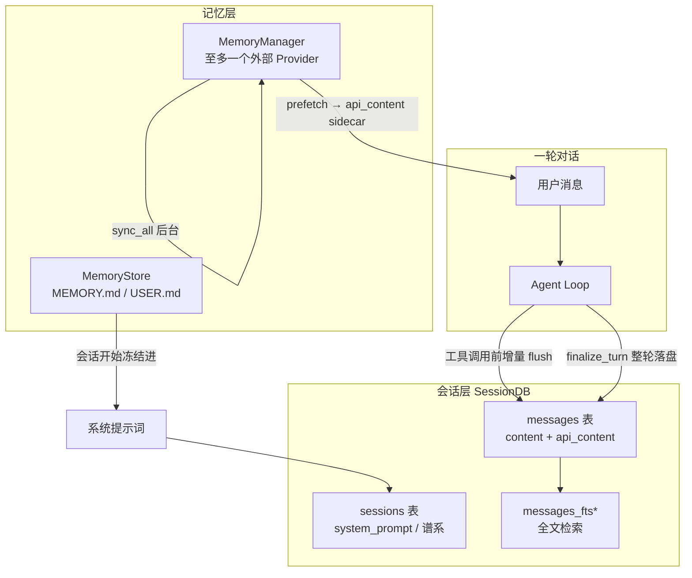
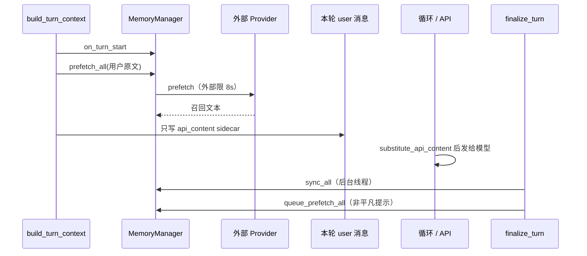
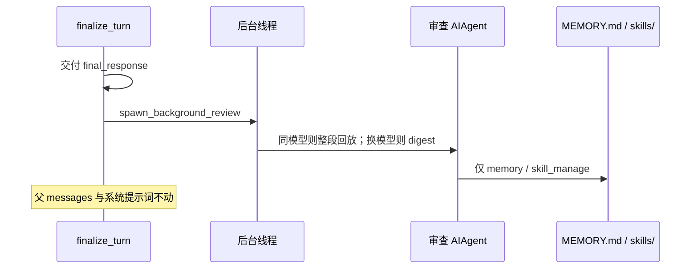

## 会话和记忆不是同一件事

上一篇写压缩时，历史被归纳为摘要，系统提示词在压缩边界上可能刷新。那份历史、那份提示词，以及模型记住用户偏好的能力，并不存在同一个地方。Hermes 把它们拆成三层；若混为一谈，后续每一处 `skip_memory` 和 `api_content` 都难以读通。

第一层是**会话（session）**：这一次对话里实际发生过的消息。它必须能在进程重启、网关每轮新建 `AIAgent` 、用户 `/resume` 之后原样回来。实现是 SQLite 库 `hermes_state.py:1791` 的 `SessionDB`，库文件在 profile 目录下的 `state.db`。

第二层是**内置记忆**：跨会话仍然有效的短笔记，存在 `MEMORY.md` （agent 自己的观察）和 `USER.md` （对用户的了解）里（`tools/memory_tool.py:1-24` ）。它们在会话开始时冻结进系统提示词，之后磁盘可以改、提示词不再改。

第三层是**外部记忆提供商**：Honcho、Mem0 一类可插拔后端，走 `MemoryProvider` ABC（`agent/memory_provider.py:81` ）。它们按当前用户消息做检索（prefetch），把结果临时附在**这一轮**发给模型的用户消息上。

三层可以先按「会不会改系统提示词」对照：

| 层            | 存什么                        | 怎样进模型                        | 本会话会不会改系统提示词               |
| ------------ | -------------------------- | ---------------------------- | -------------------------- |
| 会话 SessionDB | 本轮消息 + 当时上线的 `api_content` | `/resume` 或网关按插入序回放          | 存 `system_prompt`，会话期内原样复用 |
| 内置记忆         | `MEMORY.md`/ `USER.md`     | 会话开始冻进系统提示词                  | 磁盘可改，提示词本会话不动              |
| 外部提供商        | Honcho / Mem0 等            | prefetch 附在本轮 user 的 sidecar | 不写系统提示词                    |

三层的写入时机不同，失败代价也不同。会话写失败会标 `_incremental_persistence_failed` 并中止本轮；外部记忆失败被当成 best-effort，不能挡住用户看到回答（`run_agent.py:4104-4107` ）。

## 会话层：一条消息怎样变成可恢复的历史

### 表结构与 api_content

`SessionDB` 的表结构在 `hermes_state_common.py` 。`hermes_state_common.py:195-250` 的 `sessions`存一条对话的元数据：来源（cli / telegram / cron）、模型、完整 `system_prompt`（第 4 篇的复用就是读这一列）、`parent_session_id`（当前默认 in-place 压缩不再换 id）、以及压缩冷却、账单、工作目录等。`hermes_state_common.py:252-276` 的 `messages`存每一条 role / content / tool_calls，外加一列 `api_content`：当发给模型的字节和展示给用户的 `content`不一致时，这里保存**当时真正上线的那份**（`hermes_state.py:6096-6102` ）。没有这列，下一轮回放会少掉 prefetch 注入，前缀从这条 user 消息开始分叉——第 4 篇的缓存条件就会在这里被打破。schema 演进记在 `schema_version`表；本版本常量是 `hermes_state_common.py:155` 的 `SCHEMA_VERSION = 25`。官方会话存储文档仍写版本 11，属于文档滞后。简单加列走 `_reconcile_columns` 声明式对齐，版本门控留给改不了 ADD COLUMN 的 FTS / 索引迁移。

会话可以有标题。`hermes_state.py:5268-5274` 的 `set_session_title` 要求非空标题在库里唯一，撞名抛 `ValueError`；空白串当成清标题。`/resume` 按标题找会话、血缘里自动生成 “原标题 #2”，都依赖这道唯一约束。批量轨迹和 RL 不进这份 `state.db`。

### 整轮 persist 与工具执行前的增量 flush

写入有两条路径，都汇到 `_flush_messages_to_session_db`。一条是整轮结束时的 `run_agent.py:1885-1916` 的 `_persist_session`：去掉空响应脚手架、写 JSON 轨迹、刷 SQLite、冲掉异步 token 计数。注释强调 persist 用的"干净用户消息"只写进 DB，不改循环正在用的 live 列表（#48677）。另一条是循环内部的增量落盘：assistant 带着 `tool_calls`入列之后、工具执行之前，先 flush 一次（`conversation_loop.py:6235-6241` ）。如果接下来的工具把进程杀掉，恢复时至少还能看到那一组已经发出去的 tool_call。flush 失败会置 `_incremental_persistence_failed`，循环不再把内存里的工具结果送回模型。

### WAL 与写锁耐心

`hermes_state.py:6060` 的 `append_message` 在插入行的同时维护 `message_count`/ `tool_call_count`。库默认走 WAL（`hermes_state.py:1-10` ；`apply_wal_with_fallback`，`hermes_state.py:593` 起）：多个网关适配器可以同时读，写入走 Write-Ahead Log 串行化。NFS / 某些 FUSE / 仍带 WAL-reset bug 的 SQLite 上会退回 `DELETE`模式，且**不会**把已经是 WAL 的磁盘库现场降级，以免和其他进程抢 journal（`hermes_state.py:641-749` ）。多进程共享同一份 `state.db`时，WAL 写锁会让 TUI 卡住，所以 SQLite 自身 timeout 只给 1 秒，应用层用 20–150ms 随机抖动重试（`_WRITE_RETRY_MIN_S`/ `_WRITE_RETRY_MAX_S`，`hermes_state.py:1844-1845` ）；卡住超过 2 秒后改用 250ms–1s 的慢退避。普通写最多等 20 秒，转写写（append / 建会话行）等到 60 秒。每 50 次成功写入做一次 PASSIVE checkpoint（`hermes_state.py:1849-1850,2524,2687` ），在不阻塞读者的前提下把 WAL 帧刷回主库；真正截断 WAL 文件发生在 `close`。

### 按插入序读回，不按时钟

读回来按插入顺序，不按 `timestamp`。`get_messages`（`hermes_state.py:6775-6790` ）用 AUTOINCREMENT `id`排序，注释指向 WSL2 上 `time.time()`回退导致后写入的行时间戳更早。网关恢复会话时走 `get_messages_as_conversation`（`hermes_state.py:6996-7020` ），把行转成 OpenAI 的 `{role, content}`列表；给**实况回放**的调用方应打开 `repair_alternation=True`，否则库里残留的 `user;user` 会在之后每一轮请求里都触发一次只改副本、不改库的防御性修复。检查 / 导出路径保持默认，看到的是库里的原文。

## 全文检索：模型如何翻旧账

`session_search` 是第 3 篇里的 agent 级工具，执行时绑着当前 `SessionDB`。底层是 `hermes_state_search.py:1307` 的 `SessionSearchMixin.search_messages`。索引是一组 FTS5 虚表：`messages_fts`、`messages_fts_trigram`、以及可选的 CJK 分词扩展 `messages_fts_cjk`（启动时会做 MATCH 探测，`hermes_state.py:1172-1186` ）。超过阈值的查询打一条慢日志，便于从生产延迟中识别全表 LIKE 扫描。核心路径没有第二套 embedding 索引，也没有时间衰减公式：语义召回如果发生，只存在于当前挂上的那一个外部 MemoryProvider 的 `prefetch` 里（下一节），不在 SessionDB 这一层。

FTS 的维护本身也是会话可靠性的一部分。早期用过无界的 FTS5 `optimize`，在 10 GB 的生产库上一次能占写锁 9–18 秒，超过竞争写入的全部等待上限，表现为 "database is locked"。现在改成有页数上限的 `merge`，每个索引每轮最多几百页（`hermes_state.py:1851-1862` ）。会话层仍须保证：一次写失败可以毁掉一轮对话，因此索引整理也不能不受约束。

## 内置记忆：冻结进系统提示词的两份文件

`tools/memory_tool.py:148` 的 `MemoryStore` 读写 `~/.hermes/memories/` （经 `get_hermes_home()`，对 profile 安全）下的 `MEMORY.md`和 `USER.md`。条目用 `§`分隔，按字符数限长，因为字符数与模型无关。默认上限分别是 2200 和 1375 字符（构造函数默认值，`memory_tool.py:165-169` ；`config.yaml`的 `memory.memory_char_limit`/ `user_char_limit`可覆盖，`config_defaults.py:1655-1656` ）。`add`若加上新条目会超过上限，返回错误，并带上 `current_entries`让模型看见现有内容、自行 `replace`或 `config_defaults.py:428-441` 的 `remove`。超限即失败，从而迫使整理。`memory.memory_enabled`与 `user_profile_enabled`在 DEFAULT_CONFIG 里默认都是 True（`config_defaults.py:1640-1641` ）。

`load_from_disk` （`tools/memory_tool.py:203-238` ）做两件事。一是读出当前文件，作为工具 `see`/ `remove`时用户能看到的 live 状态。二是扫一遍注入/渗透模式，命中的条目在**快照**里替换成 `[BLOCKED: …]`，再渲染成系统提示词块。live 列表保留原文，用户才能发现并删掉被投毒的条目；快照一旦建好，本会话不再重算——扫描是磁盘字节的纯函数，所以快照字节稳定，前缀缓存成立。模块文档写明：中途 `memory`工具写入立刻落盘，但**不**刷新系统提示词，下一会话才换新快照（`tools/memory_tool.py:1-24` ）。

初始化时，`skip_memory=True` 会跳过外部提供商，但若调用方显式启用了 `memory` 工具集，仍然会创建 `MemoryStore`。否则 `memory`工具带着 `store=None`分发，每次调用都失败（`agent_init.py:1659-1664` ，#65429）。cron 和子代理通常不启用这个工具集，所以两条路径一起关掉。

## 外部提供商：检索进 sidecar，同步放后台

### Provider ABC 与只接受一个外部后端

`memory_provider.py:81` 的 `MemoryProvider` 规定外部后端必须实现的面：`is_available`/ `initialize`/ `prefetch`/ `sync_turn`/ `get_tool_schemas`/ `handle_tool_call`/ `shutdown`。可选钩子包括压缩前抽取（`on_pre_compress`）、会话旋转（`on_session_switch`）、以及父 agent 观察子代理结果（`on_delegation`）。`system_prompt_block`只放静态说明，动态召回走 prefetch，两者分开，避免每轮改系统提示词。`on_pre_compress`在第 4 篇的压缩路径里被真正调用：`memory_manager.py:974-991` 的 `MemoryManager.on_pre_compress`向每个外部提供商广播即将被丢掉的消息，把返回文本拼进摘要 prompt；提供商失败只打 debug，不挡住压缩。

`memory_manager.py:364` 的 `MemoryManager` 是唯一编排点：同时只接受一个非 builtin 的外部提供商，第二个 `add_provider` 会被拒绝并打日志（`memory_manager.py:404-426` ）。提供商工具名不得撞 `_HERMES_CORE_TOOLS` （`memory_manager.py:430-453` ，#40466）；schema 要先 `normalize_tool_schema`，有的后端已经包成 OpenAI tool 形态，再包一层会变成没有顶层 `name`，严格提供商会以整份工具列表 400 拒绝（`memory_manager.py:50-68` ，#47707）。

### prefetch 只写 api_content

一轮里外部记忆出现两次。循环前，`build_turn_context` 先 `on_turn_start`，再对非平凡用户文本做 `turn_context.py:1147-1166` 的 `prefetch_all`。`memory_provider.py:61-78` 的 `is_trivial_prompt`把空输入、斜杠命令、以及 "hi" / "thanks" / "ok" 这类应答判为无语义，跳过检索，既省一次阻塞网络，也避免用零信号查询把过期用户模型灌进回复。取回的文本经 `turn_context.py:53-85` 的 `compose_user_api_content`包进 `<memory-context>`围栏，**只写在本轮 user 消息的** `api_content`**上**；库里的 `content`仍是用户原话。插件 `pre_llm_call`返回的上下文走同一个 helper（第 4 篇），两路拼在同一条 sidecar 上。循环组 `api_messages`时用 `substitute_api_content`把 sidecar 填回 `content`，下一轮回放同一条 sidecar，前缀从这里起仍然对齐（`agent/turn_context.py:1168-1176` 把这个不变量写进了注释）。

循环结束后，`finalize_turn` 调用 `_sync_external_memory_for_turn` （`run_agent.py:4075` ），用**未展开 skill 脚手架的**原始用户文本做 `sync_all`，避免把整份 SKILL.md 写进后端；若本轮被中断则整段跳过——未完成的工具链不是用户看见并完成的对话，写进去会污染以后的召回。`sync_all`本身在单线程后台跑（`memory_manager.py:638-661` ）：注释记录过配置错误的 Hindsight 守护进程阻塞约 298 秒，若同步执行，CLI / TUI / 网关都会把 agent 标成仍在 running，用户下一条消息会触发不必要的中断。后台写入按轮次串行，提供商不必自己保证顺序。紧接着对非平凡提示 `queue_prefetch_all`，为下一轮预热。外部 prefetch 调用另有 8 秒超时，超时本轮当空（`memory_manager.py:47,580-588` ）。

`initialize` 的 kwargs 带 `agent_context`：`primary`/ `subagent`/ `cron`/ `flush`。ABC 文档写明，非 primary 上下文应当跳过写入，以免 cron 的系统提示词或子代理的中间状态写进用户画像（`memory_provider.py:106-114` ）。这与下面的 `skip_memory` 是同一条约束的两端：一端是根本不把提供商拉起来，一端是提供商自己再守一道。

## 哪些路径故意不装记忆

定时任务创建 `AIAgent` 时传 `skip_memory=True`，注释只有一句：cron 的系统提示词会腐蚀用户画像（`cron/scheduler.py:3517` ）。cron 会话仍然进 SessionDB（有独立的 cron session id），只是不跑 MemoryStore 快照，也不初始化外部提供商。子代理同样 `tools/delegate_tool.py:1526` 的 `skip_memory=True`；子代理没有自己的提供商会话，任务与结果由父 agent 的 `on_delegation`观察（`memory_provider.py:270-276` ）。background-review 的 fork 也是 `skip_memory=True`，避免和主会话抢同一套用户模型。

综合来看：SessionDB 记录「发生过什么」，包括 cron；记忆层记录「关于用户与世界的长期判断」，只属于主对话。两条管道分开，压缩、委派、定时任务才不会把临时上下文写进长期记忆。

## 计数器触发的后台复盘

主循环不会在每一轮结束时改系统提示词里的记忆或技能索引。它改的是两个计数器，够了再 fork 一个审查 Agent，让审查结果只落磁盘。

### 记忆按用户回合，技能按 API 圈数

记忆计数按**用户回合**，`build_turn_context` 在追加本轮 user 消息之后，若 `memory` 在 `valid_tool_names` 且 `_memory_store` 存在，就把 `_turns_since_memory` 加一；达到 `_memory_nudge_interval` 则置 `should_review_memory` 并清零（`turn_context.py:583-591` ）。间隔默认 10，配置键是 `memory.nudge_interval` （`agent_init.py:1656, 1671` ）。从历史恢复会话时，用已有 user 消息数对间隔取模把计数补回去，避免 `/resume` 把计数打回零、再也达不到阈值（`turn_context.py:535-543` ）。

技能计数按**循环迭代**累计，不按用户回合清零。每进一次 while 圈，若间隔大于 0 且 `skill_manage` 仍在工具名单，`_iters_since_skill` 加一（`conversation_loop.py:1467-1471` ）。新一轮 `build_turn_context` **不**重置这两个计数器（`turn_context.py:491` ）。`finalize_turn` 里若累计值达到 `_skill_nudge_interval`，则置 `_should_review_skills`并清零（`turn_finalizer.py:698-704` ）。间隔默认 10，配置键 `agent_init.py:1756-1759` 的 `skills.creation_nudge_interval`。因此这是“自上次技能写入或审查以来的 API 圈数”，不是“本轮工具调用条数”。DEFAULT_CONFIG 没有列出这两个 nudge 键，缺省走代码里的 10。

两个标志任一为真、本轮有 `final_response` 且未被中断，就 `turn_finalizer.py:714-724` 的 `agent._spawn_background_review`。注释写明审查发生在回答已经交给用户之后，不和用户任务抢模型注意力。异常全部吞掉：审查是 best-effort。

### fork：写磁盘，不改父前缀

fork 的构造在 `agent/background_review.py` 。模块文档（`agent/background_review.py:1-17` ）把不变量写在前面：写入直达记忆文件和技能目录，主对话和提示词缓存永不改。默认继承父的 provider / model / 凭证，好打同一段前缀缓存；若 `auxiliary.background_review.{provider,model}`指到另一台模型，缓存必 miss，于是改放压缩过的 digest，少写冷 token（`agent/background_review.py:33-43` ）。`agent/background_review.py:800` 的 `skip_memory=True`阻止 fork 自己再初始化外部 MemoryProvider——否则 harness 提示词会经 `on_turn_start`/ prefetch / sync_all 漏进用户的 Honcho / Mem0 命名空间（`agent/background_review.py:712-726` 的注释）。内置 `MemoryStore`随后从父实例重新绑上（`agent/background_review.py:812-814` ），所以审查里的 `memory(action="add")`仍写同一对 MEMORY.md / USER.md。技能 nudge 间隔在 fork 上被置 0（`agent/background_review.py:815-816` ），避免审查再触发审查。

工具面在运行时再收窄一次。schema 请求仍用父的 enabled/disabled toolsets，保证请求体里的 `tools[]` 与父字节一致、Anthropic 缓存键对得上（`agent/background_review.py:727-729` ）；真正能 dispatch 的名字来自白名单：工具集只有 `skills`，父若开了 memory 再加 `memory`（`agent/background_review.py:893-908` ）。白名单外的调用返回固定拒绝句。fork 还关掉压缩、跳过 MCP 刷新（`agent/background_review.py:811,881` ），避免审查过程给父前缀多出工具或改写历史。

审查用哪份 prompt 由两个 nudge 是否同时触发决定：只记忆、只技能、或合并（`spawn_background_review_thread`，`agent/background_review.py:1030-1050` ）。

### 写审批默认关

`config.yaml` 里还有两道默认关闭的写闸：`memory.write_approval` 和 `skills.write_approval` （`config_defaults.py:1642-1654, 1817-1828` ）。打开之后，前台写入要审批，后台审查的写入改为暂存（`/memory pending` 、`/skills pending` ），因为 daemon 线程不能 `Event.wait` 等用户。

## 文档对照

`MemoryManager` 的类文档写着 "The builtin provider is always first"（`memory_manager.py:364-368` ），`add_provider` 也按 `name == "builtin"` 放行。生产初始化（`agent_init.py:1687-1697` ）却只在配置了 `memory.provider` 时 `add_provider` 外部插件，**并不**注册一个名为 `builtin` 的 `MemoryProvider`。内置记忆是旁边的 `agent._memory_store = MemoryStore(...)`。读 Manager 文档会以为两层都在同一张提供商表里；读 init 才能看到它们是并行的两套对象。本文以 init 为准。

`AGENTS.md` 把 honcho、mem0 等列在"内置记忆提供商"下。它们是仓库里自带的**外部插件**，和 `MEMORY.md` 不是同一层。本篇的"内置"专指文件快照。

## 小结

Hermes 的持久化可以按「会不会改系统提示词」切开。SessionDB 记下每条消息和那条消息当时真正发给模型的字节（`api_content` ），并用插入序恢复；工具调用在执行前先落盘，避免崩溃留下协议空洞。内置记忆把跨会话笔记冻结在系统提示词里，本会话只改文件；超限时 add 失败并交回现有条目。外部提供商把召回垫在本轮 user 消息的 sidecar 上，同步放到后台，中断轮次不写。cron 和子代理关掉记忆初始化，以免系统任务和委派中间态写进用户画像。记忆和技能的积累不在主循环里改前缀：两个 nudge 计数达到阈值后，再 fork 一个工具白名单收窄的审查 Agent，写磁盘、不碰父对话。三层都在第 4 篇的缓存约束下工作：能进系统提示词的，会话期内不许变；每轮不同的，只能附在历史末尾的 sidecar 上，并且必须和当时上线的字节一起存下来。
