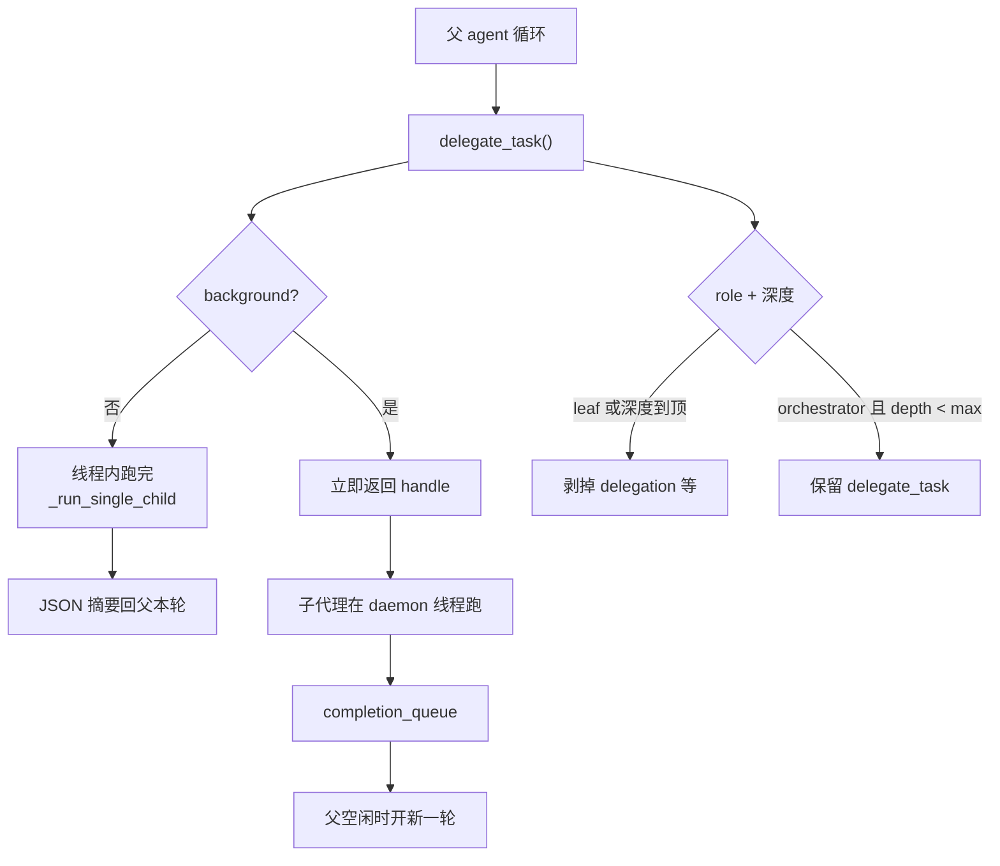

## 委派解决什么问题

Agent loop 是单线程、单上下文的：历史、工具结果、系统提示词都在同一份 `messages` 里生长。有些工作（并行查询三个仓库、让一个便宜模型先扫一遍代码）如果塞进同一段历史，会同时放大父对话的前缀缓存开销并分散注意力。`tools/delegate_tool.py:2779` 的 `delegate_task` 另开一个 `AIAgent`：子代理从空白对话开始，用自己的 `task_id`（独立终端会话与文件缓存），跑完只把摘要交回父对话。父上下文里只出现一次工具调用和一条结果，看不到子代理中间的工具轨迹（`tools/delegate_tool.py:1-18` ）。

调用形态有两种：只给 `goal` （加可选 `context` 、`role` ）的单任务和给 `tasks: [{goal, context, role}, ...]` 的批量任务，每个元素一个子代理。两种都返回 JSON，批量时一项对应一个结果。

## 子代理被剥夺的能力

子代理默认角色是 `leaf`。`DELEGATE_BLOCKED_TOOLS`（`tools/delegate_tool.py:47-56` ）列出它不能碰的名字：`delegate_task`（禁止无界递归）、`clarify`（不能问用户）、`memory`（不能写共享的 MEMORY.md）、`send_message`（不能替父代理对外发消息）、`cronjob`（不能用父的名义再挂定时任务）。`execute_code` 不在这个集合里，leaf 仍可做程序化工具调用。

剥离分两步。`_strip_blocked_tools` （`tools/delegate_tool.py:894-912` ）从工具集名单里去掉"全部成员都在黑名单里"的集合，以及复合集 `delegation` 和 `kanban`。像 `hermes-cli`这种既含被禁工具又含有用工具的包必须留下，否则子代理会丢掉整个 CLI 工具面。第二步把精确的单工具 deny 集放进 `disabled_toolsets`（`tools/delegate_tool.py:1289-1308` ），让 `get_tool_definitions` 在复合展开之后再扣掉黑名单名字，并且在之后的 registry / MCP 刷新里仍然生效。

`role="orchestrator"` 从黑名单里拿回 `delegate_task` （`tools/delegate_tool.py:926-927` ），并无条件把 `delegation` 工具集加回子代理（`tools/delegate_tool.py:1311-1316` ）——注释写明这是角色授予，不是从父工具集继承。父即使自己没开 delegation，orchestrator 子代理仍然能再派工。实际是否按 orchestrator 落地，还要过 `_build_child_agent` 里的一道闸：`orchestrator_enabled` 为真，且 `child_depth < max_spawn_depth`，否则强制降为 leaf（`tools/delegate_tool.py:1236-1239` ）。深度从父的 `_delegate_depth` 加一；父是 0。

## 深度、并发、预算

`MAX_DEPTH` 在源码里是 **1**（`tools/delegate_tool.py:127` ）：默认扁平，父可以生子，孙子被拒。`_get_max_spawn_depth` 无配置时返回这个常量（`tools/delegate_tool.py:595-613` ）。要嵌套编排需要把 `delegation.max_spawn_depth` 显式调到 2 或更高，没有硬顶，但每一层都按子代数乘 API 费用。

这里有一处文档和注释都落后于常量。`AGENTS.md` 的 Delegation 节写默认 `max_spawn_depth` 为 2；`delegate_task` 函数里也有一句 "default 2 for parity with the original MAX_DEPTH"（`tools/delegate_tool.py:2826-2827` ）。常量本身和 `_get_max_spawn_depth` 的 fallback 都是 1。公开解读文章同样常写默认 2。以常量为准。

并发帽是 `delegation.max_concurrent_children`，默认 3（`tools/delegate_tool.py:120,482-520` ）。批量 `tasks`长度超过这个值直接 `tool_error`，不排队（`tools/delegate_tool.py:2873-2878` ）。`background=true`的异步派发共用同一顶：满员时拒绝异步、回退到同步跑完，避免模型把后台任务堆成无界队列（`tools/delegate_tool.py:526-550` ）。`max_async_children` 已被废弃，配置里残留只打一次警告。

每个子代理的迭代预算是新的 `IterationBudget`，不继承父的计数器（`iteration_budget=None`）。上限来自 `delegation.max_iterations`，默认 50（`agent/agent_init.py:714、2841`）。模型在工具参数里传入的 `max_iterations`被忽略，避免缓存的旧 schema 在运行中把预算改小（`agent/agent_init.py:2842-2853` ）。记忆初始化同样关掉（`skip_memory=True`，`agent/agent_init.py:1526` ）。项目上下文也关掉：`agent/agent_init.py:1525` 的 `skip_context_files=True`。`load_soul_identity`形参默认 False（`run_agent.py:496` ），于是 `build_system_prompt_parts`不读 SOUL.md，stable 身份回落到 `system_prompt.py:193-201` 的 `DEFAULT_AGENT_IDENTITY`。子代理因此既不带着用户的 MEMORY.md，也不带着用户的人格文件和仓库 AGENTS.md 去跑一次性任务。会话库则共享：构造时传入父的 `session_db`和 `delegate_tool.py:1529-1530` 的 `parent_session_id`，子轨迹能查到、能挂在父会话谱系上，只是自己的 `session_id` 是新的。

推理强度可以和父不同。`delegation.reasoning_effort` 有合法值时覆盖父的 `reasoning_config`；未配置则继承（`tools/delegate_tool.py:1437-1457` ）。YAML 里写成 `false`必须按布尔 False 处理——注释专门警告不能 `str(x or "")`，否则会变成空串、在未察觉的情况下继承父级。备援链同样继承父的 `_fallback_chain`（`tools/delegate_tool.py:1459-1463` ），子代理遇到限流时走和顶层一样的切换，而不是固定使用一把密钥。

## 一次同步委派在线程里做什么

`_build_child_agent` 在主线程构造子 `AIAgent` （线程安全），真正的 `run_conversation` 丢进 `DaemonThreadPoolExecutor` 的单工人池（`tools/delegate_tool.py:2148-2194` ）。默认没有墙钟超时——注释说该中断的是卡住，而不是耗时长的深度审查；卡住靠心跳：子代理的活动时间戳定期写回父代理，以免网关的 inactivity 超时把还在工作的父会话杀掉（`tools/delegate_tool.py:2001-2004` ）。若配置了 `child_timeout_seconds` （正数，下限 30 秒），超时后对子代理发硬中断。

工人线程有自己的危险命令审批回调，默认 auto-deny（`tools/approval.py:59-75` ）。子代理跑在 ThreadPoolExecutor 里，继承不到 CLI 存在 `threading.local` 里的交互回调；若不安装，会在工人线程里 `input()`，和占着 stdin 的父 TUI 死锁。网关会话不受这条 TLS 回调影响，它们走 `tools/approval.py` 的按会话队列。

构造完成后，孩子被登记进父的 `_active_children` （`run_agent.py:1578-1585` ，锁在 `agent_init.py:807-808` ）。父调用 `interrupt`时会复制这份列表并扇出：`hard_cancel`走 `request_hard_interrupt`，否则 `run_agent.py:3141-3151` 的 `child.interrupt`。同步委派若配置了墙钟超时，超时分支也会对**这一个** child 发硬中断（`run_agent.py:2198-2200` ）。用户在 CLI 按 Ctrl+C 或网关 `/stop`，正在跑的子代理不能继续消耗配额。

跑完后，`_run_single_child` 把 `model_tools._last_resolved_tool_names` 恢复成子代理构造前保存的父列表（`tools/delegate_tool.py:2563-2569` ）。这个名字是进程全局的，子代理初始化会把它改成自己的工具面；`execute_code` 等路径若读到子代理的名单，父后续调用会错。AGENTS.md 的 Known Pitfalls 专门记了这一点。

## 异步委派：结果何时回到对话

这里的 `background=true` 是异步委派，和第 5 篇的后台审查（background-review）不是同一条路径。

`background=true` 时，父本轮立刻拿到一个委派 id，子代理在模块级 daemon 执行器上跑（`tools/async_delegation.py:1-8` ）。完成事件推进程共享的 `completion_queue`，类型为 `async_delegation`。CLI 的 process_loop 和网关的 process watcher 本来就会在 agent 空闲时抽这条队列（终端后台任务完成也走这里）。设计选择是复用这条轨道，而不是往正在跑的循环里塞消息：完成作为**新的一轮**出现，不会插在 tool 结果和 assistant 之间，角色交替和前缀缓存都还成立（`tools/async_delegation.py:9-22` ）。载荷带上原始 goal、上下文、工具集、模型、状态和摘要——父对话可能已经聊到别处，需要这份自描述才能决定采用还是重派。

批量背景委派是一个异步单元：所有孩子跑完后只推一条完成事件，对话里只再进一轮。派发本身可被 `is_spawn_paused()` 挡住（`tools/delegate_tool.py:2805-2812` 的 `delegate_task`），用于 TUI 发现扇出失控时冻结新 spawn，已在跑的孩子不打断。

## 文档对照

`MAX_DEPTH = 1` 与 `AGENTS.md` 、以及 `delegate_task` 函数体内 "default 2" 的注释不一致。运行时默认扁平一层。若按文档把嵌套编排当成开箱即用，会在第一层孩子再 `delegate_task` 时收到深度超限错误。

官方 Provider 运行时文档写子代理「继承父的 provider，但不继承回退配置」。源码把父的 `_fallback_chain` 原样传进 `delegate_tool.py:1461-1518` 的 `fallback_model=`。以构造参数为准：孩子遇到限流时走和顶层一样的切换。

## 小结

委派把并行执行、更换模型、隔离中间历史从父循环中移出：子代理从空白上下文起步，不加载 SOUL.md / AGENTS.md / 记忆；leaf 拿不到再委派、记忆、澄清和对外副作用；orchestrator 只在深度预算允许时拿回 `delegate_task`。并发和深度都是硬拒绝而不是排队；预算和记忆各自独立，避免父约束被孩子绕开。父中断会扇出到 `_active_children`。同步委派阻塞本轮直到摘要回来；异步委派走与终端后台任务相同的完成队列，空闲时开新一轮，以免破坏角色交替。进程全局的工具名表在孩子进出时必须成对保存/恢复——这是委派实现里与缓存、记忆同类的不变量，只是作用域是进程而不是会话。
