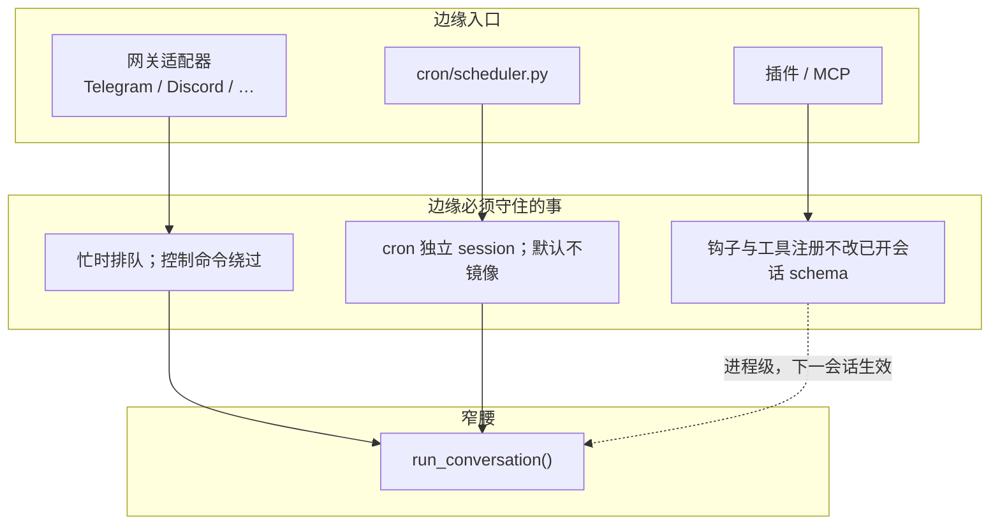

## 窄腰之外还有什么

前面几篇都围绕同一个函数：`conversation_loop.run_conversation` 调模型、执行工具、写会话、必要时压缩。这个循环是 Hermes 的窄腰——每次 API 调用都要带上工具 schema，系统提示词必须在会话期内字节稳定，消息角色必须严格交替。窄腰一旦膨胀，成本按轮次相乘。

产品不能只存在于命令行。用户从 Telegram 发一条消息、在 cron 里挂一个每天早上的简报、给 agent 接一个 GitHub MCP、再装一个自己写的插件，这些都不该各自实现一套循环。边缘层的工作是：把不同入口的事件整理为同一种「用户消息 + 会话键」，交给同一个 `run_conversation`，同时保证边缘上的包装、排队、投递不会回写进窄腰的不变量。

本文按这条边界展开：网关如何把多平台事件整理成一轮对话；插件和 MCP 如何在不改核心工具清单的前提下增加能力；cron 为何必须使用独立会话。配置与 Profile、Curator、观测导出也落在同一条边界上，后文一并说明。

## 网关：同一套循环，两道守卫

### 会话键与隔离规则

每个消息平台实现一份适配器，继承 `gateway/platforms/base.py` 的 `BasePlatformAdapter`。适配器负责把平台事件整理为统一的 `event`（文本、用户、会话键），真正跑模型的是网关 runner（`gateway/run.py` ）。会话键由 `gateway/session.py:1058` 的 `build_session_key`从 platform / chat 类型 / 用户 / 可选线程算出来，调用点在适配器入口（`base.py:5578-5582` ）。函数文档写明这是唯一构造入口，不要手写键。默认命名空间是 `agent:main`；多 profile 复用网关时变成 `agent:{profile}`，位置布局不变，避免两套 HERMES_HOME 争用同一把 Telegram chat（`_session_key_namespace`，`gateway/platforms/base.py:1038-1055` ）。隔离规则写在函数文档里（`base.py:1073-1094` ）：私聊按 chat（再加 thread）分开；群聊默认 `group_sessions_per_user=True`，同一频道里每个人一份上下文，避免 A 的对话污染 B；群里的论坛主题 / Discord thread 默认 `thread_sessions_per_user=False`，同一条线程共享一份会话，因为线程本身就是话题。WhatsApp、Signal、Telegram、BlueBubbles 的 user id 在进系统提示词前会做哈希（`_PII_SAFE_PLATFORMS`，`gateway/platforms/base.py:349-357` ）；Discord 故意排除，因为 `<@user_id>` 提及需要真实 id。

### 过期策略与 85% 预清理

同一把键上，同一时刻只允许一个 handler：`_active_sessions` 里有条目，就说明这一轮还在跑。会话何时作废由 `SessionResetPolicy` 管（`gateway/config.py:486-501` ）：`daily`/ `idle`/ `both`/ `none`，优先级 platform > 会话类型 > 全局默认。**当前默认是** `none`——不自动清空上下文，除非用户在 `session_reset`里打开。2026 年 7 月之前默认曾是 `both`（每天 4 点或 24 小时空闲），会使仍以为对话在继续的用户遇到上下文被清空。后台 `_session_expiry_watcher`默认每 5 分钟扫一次（`gateway/run.py:11807-11816` ）；过期时走 `finalize_session(..., reason="session_expired")`，并避开仍挂着后台进程的会话。历史已经很长、但会话还没过期时，网关在创建 agent 之前还有一层 85% 的会话清理（第 4 篇），防止隔夜积累的 transcript 把第一次 API 调用直接打成 413。

### 第一道守卫：忙时排队

普通跟进消息不能插进正在跑的循环——那会在 tool 结果和 assistant 之间再塞一条 user，角色交替和前缀缓存一起坏掉。适配器把它们放进 `_pending_messages`，等本轮结束再排。这是第一道守卫。入口处还有一次自愈：若锁还在、所属任务已经结束或取消，`_heal_stale_session_lock`清掉陈旧锁再往下走，避免用户卡在已死的守卫后面（`gateway/platforms/base.py:5584-5590` ，issue #11016）。

### 控制命令必须绕过队列

控制命令不能走同一条队列。`/stop` 、`/new` 若被当成待处理用户文本，会在循环结束后泄漏进下一轮；`/approve` 、`/deny` 若排队，agent 正阻塞在 `Event.wait` 上，审批永远到不了，形成死锁。`hermes_cli/commands.py:466-486` 的 `should_bypass_active_session` 对**任意能解析的斜杠命令**返回真：能解析的命令要么有 runner 里的二级处理器，要么落到"忙，先等或 /stop"的兜底，两条路都是分发而不是入队。曾经把 `/model` 这类命令送进 pending 队列时，runner 的安全网会丢掉命令文本，用户得到空回复（issue #5057）。

绕过之后仍分两路。`busy_policy == "interrupt_then_dispatch"` 的命令（`/stop` 、`/new` 、`/reset` ）走 `_dispatch_active_session_command`，先取消进行中的适配器任务，再按序回 runner、排空 pending（`base.py:5610-5625` ，`commands.py:451-463` ）。`/approve` 、`/deny` 、`/status` 等只需要直达 runner，不取消当前任务（`base.py:5627-5629` ）。注释写明：不要用 `_process_message_background` ——它自己管理会话生命周期，会和正在跑的任务抢清理（`base.py:5600-5603` ）。

### 第二道守卫：runner 分发

第二道守卫在 runner。斜杠命令经 `is_gateway_known_command` 之后按 canonical 名分发（`gateway/run.py:14891` 起，`/new` 在 `gateway/run.py:14939` 、`/stop` 在 `gateway/run.py:14994` ）。消息平台上用户更常打 "yes" 而不是 `/approve`：当 `has_blocking_approval(session_key)`为真，裸词 `yes`/ `approve`/ `no`被合成到同一套 `_handle_approve_command`/ `_handle_deny_command`，避免回复排在一个等审批才能结束的轮次后面（`gateway/run.py:8668-8708` ）。两道都绕过之后，普通对话才进入 `gateway/run.py:5316` 的 `agent.run_conversation`。

### 授权、token 锁与投递

进循环之前还有谁被允许说话。`gateway/authz_mixin.py:387-395` 的 `_is_user_authorized` 按顺序看：平台级 `*_ALLOW_ALL_USERS` 、环境变量白名单（如 `TELEGRAM_ALLOWED_USERS` ）、DM pairing 已批准名单、全局 `GATEWAY_ALLOW_ALL_USERS`，全不是则拒绝。Home Assistant 与入站 webhook 不走这张表：前者凭 HASS token，后者在适配器里验 HMAC（`gateway/authz_mixin.py:403-404` ）。适配器 `connect()`时对 bot token 一类唯一凭据调用 `gateway/status.py:1362-1367` 的 `acquire_scoped_lock`，`disconnect()` 时释放，避免两个 profile 的网关争用同一把 Telegram bot。

出站并不都回到原聊天。`gateway/delivery.py:1-8` 按显式目标（`telegram:123` ）、平台主频道、任务来源、以及落盘本地文件分流；cron 输出默认走这一层而不是写进用户正在进行的那条历史（见下文镜像开关）。

### 程序化入口与实例缓存

桌面端和 Ink TUI 不走这套适配器。它们通过 `tui_gateway` 的 JSON-RPC 调到同一个 `tui_gateway/server.py:9648` 的 `run_conversation`；ACP（`acp_adapter/server.py:1908` ）和批量跑数（`batch_runner.py:349` ）也是。HTTP 入口是 `gateway/platforms/api_server.py` ：兼容 OpenAI 的 Chat Completions 与 Responses，再加上 `/v1/runs` 的异步运行与审批。三种程序化协议（ACP stdio、TUI JSON-RPC、HTTP API）驱动的是同一个 `AIAgent`，差别只在线路格式。入口不同，窄腰同一个。

网关进程是长驻的，不能每条消息都 new 一个 `AIAgent` 再丢弃。runner 维护一份实例缓存：最多 128 个，空闲超过 3600 秒驱逐（`gateway/run.py:71-72` ）。公开文章写的「最多 128、空闲 1 小时清理」与这两行常量一致。缓存命中的是同一把会话键上的运行时（客户端、工具 schema、记忆提供商），所以跨平台续聊依赖的是 session_id / SessionDB，而不是把 CLI 的对象搬到 Telegram。

### DM pairing

私聊还有一道人的门。`gateway/pairing.py` 用一次性配对码授权未知用户，不是只靠静态 user id 白名单（`gateway/pairing.py:1-18` ）：8 字符、避开 0/O/1/I，一小时过期，每平台最多 3 个 pending，同一用户十分钟内只能申请一次，连续失败五次锁定一小时，数据文件 `chmod 0600`，码不打到 stdout。

### 入站与出站 webhook

入站 webhook 是网关适配器里的一种，不是另写一条循环。`gateway/platforms/webhook.py:1-31` 的 `WebhookAdapter` 起一个 aiohttp HTTP 服务，按 `platforms.webhook.extra.routes` 把外部 POST（GitHub、GitLab、Stripe 一类）校完 HMAC 之后整理为 prompt。每条路由可以指定事件过滤、技能列表、以及把回复投递到哪；`deliver_only: true` 时跳过 agent，渲染后的模板直接发出去——注释写明给监控告警、跨 agent ping 这类零 LLM 成本场景使用。HMAC 密钥在启动时必填，另有按路由的限速和幂等缓存，避免 webhook 重试把同一事件跑两遍。平台枚举是 `gateway/run.py:13682-13689` 的 `Platform.WEBHOOK`。

方向反过来的是出站通知。`agent/outbound_webhooks.py:1-28` 读 `hooks.outbound`，把现有 plugin hook（`on_session_end`、`pre_tool_call`等）的一次触发序列化进有界队列，由单工人线程 POST 出去。回调必须立刻返回，不能在循环里等网络；有 secret 时签 `X-Hermes-Signature-256`。网关启动时注册（`gateway/run.py:10857-10860` ）。入站将外部事件导入 Hermes，出站将 Hermes 的动作通知外部系统，两者都不改工具 schema。

## 插件：钩子加能力，不改核心清单

### 四源发现与 opt-in 加载

通用插件由 `hermes_cli/plugins.py` 的 `PluginManager` 发现。来源有四个，后写覆盖先写（`hermes_cli/plugins.py:5-17,1336-1390` ）：仓库 `plugins/<name>/` （跳过 `memory/` 、`context_engine/` 、`model-providers/`，它们各有发现路径）、`get_hermes_home()/plugins/`（用户安装）、当前目录 `./.hermes/plugins/` （需 `HERMES_ENABLE_PROJECT_PLUGINS` ）、以及 `hermes_agent.plugins` 这一 pip entry-point 组。每个目录插件要有 `plugin.yaml` 和带 `register(ctx)` 的 `__init__.py` 。

不是扫到就加载。仓库里 `kind == "backend"` 的捆绑插件自动加载；`kind == "platform"` 的适配器只注册延迟加载器，避免 `hermes chat` 也去 import discord.py（`hermes_cli/plugins.py:1446-1467` ）。其余——用户插件、独立捆绑插件、entry-point——必须出现在 `plugins.enabled` 里，否则只记清单、不 import（`hermes_cli/plugins.py:1469-1488` ）。`discover_plugins()` 默认幂等，`force=True` 才重扫（`hermes_cli/plugins.py:2059-2065` ）。

### 钩子、覆盖内置、已开会话不换 schema

插件能做的事沿着 `VALID_HOOKS` （`hermes_cli/plugins.py:135-164` ）：`pre_tool_call`/ `post_tool_call`拦或改工具，`pre_llm_call`/ `post_llm_call`看模型进出，`on_session_start`/ `on_session_end`跟会话寿命。`ctx.register_tool`把工具写进与内置工具同一个 `tools.registry`（`hermes_cli/plugins.py:410-423` ）。覆盖已有内置名必须同时给 `override=True`，并在 `config.yaml`里为该插件打开 `plugins.entries.<id>.allow_tool_override`（`hermes_cli/plugins.py:430-445` ）。没有这道门，任意已启用插件都可以换掉 `write_file` 一类特权工具。

钩子和工具注册发生在进程级。已经开着的会话不会中途换 schema——那是第 4 篇的缓存约束。插件改动跟 `/skills install` 一样，默认下一会话才进模型眼前的清单。

### Gateway hooks 是另一张表

网关自己还有一套与插件 `VALID_HOOKS` 分开的事件。`gateway/hooks.py` 从 `get_hermes_home()/hooks/`加载目录，每个目录一份 `HOOK.yaml`（name + events）和 `handler.py` 里的 `gateway/hooks.py:1-19,88-100` 的 `async def handle`。事件包括 `gateway:startup`、`session:start/end/reset`、`agent:start/step/end`、`command:*`。错误只记日志，不挡主路径。`_register_builtin_hooks`是空操作存根（`gateway/hooks.py:72-79` ），发行版不附带内置 hook。这和 `ctx.register_hook` 的插件生命周期不是同一张表：一个跟消息平台进程，一个跟 agent 工具/LLM 调用。

## 配置、Profile 与 HERMES_HOME

CLI、网关、cron 读的是同一份用户状态，但一个用户可以跑多个互不看见的实例（例如 coder 用一套模型，researcher 用另一套）。隔离不是多租户数据库，而是换根目录。`hermes -p coder` 在**任何业务模块 import 之前**由 `hermes_cli/main.py:517-519` 的 `_apply_profile_override` 解析 `-p/--profile`，把 `HERMES_HOME`指到该 profile 的目录。之后 `hermes_constants.py:114-139` 的 `get_hermes_home()`按 override → 环境变量 → 平台默认解析；config、`.env` 、skills、sessions、cron、memories 都挂在这个根下。环境变量没设、但 sticky `active_profile` 又不是 default 时，函数仍返回默认根，并打一次警告——子进程漏传 `HERMES_HOME` 时宁可继续运行，也不能在 import 期抛异常（#18594）。

命名 profile 的列表根是**默认** Hermes 目录下的 `profiles/`，不是当前 `hermes_cli/profiles.py:264-275` 的 `get_hermes_home()/profiles`。这样 `hermes -p coder profile list` 仍能看见全部 profile。文件工具侧还有跨 profile 写保护（第 3 篇），系统提示词里也会写明当前 profile 路径（第 4 篇），避免模型改到另一套 skills/cron。

行为配置进 `config.yaml`，API 密钥进 `hermes_cli/config.py:1-7` 的 `.env`。`.env` 是密钥文件，不是功能开关箱；超时、阈值、工具集这类项写在 YAML 里。三条加载路径（CLI 的 `load_cli_config` 、子命令的 `load_config` 、网关直接读 YAML）必须覆盖同一份用户文件，否则会出现“CLI 看见了、网关没看见”。

## MCP：目录是安装面，客户端是注册面

MCP（Model Context Protocol）让外部进程通过 stdio、Streamable HTTP 或 SSE 暴露工具。Hermes 把它拆成两层，避免把"别人家的服务器"焊进核心树。

### 目录层：批准并钉住安装

目录层在 `hermes_cli/mcp_catalog.py` 。条目落在 `optional-mcps/<name>/manifest.yaml`，默认关闭，和 optional-skills 同一模式。用户用 `hermes mcp catalog`/ `hermes mcp install`（或交互 picker）启用。模块文档写明：进目录等于 Nous 背书，没有社区档；清单固定启动命令和版本，升级要用户再跑一次 install（`hermes_cli/mcp_catalog.py:1-26` ）。

### 运行时层：连上并登记进同一张表

运行时层在 `tools/mcp_tool.py` 。它读 `config.yaml`的 `mcp_servers`，连上之后把对方的工具 `registry.register`进同一张表，模型侧看起来和内置工具没有区别（`tools/mcp_tool.py:1-11,6221-6231` ）。`discover_mcp_tools()`在 `discover_builtin_tools()`之后由 `model_tools`调用（`tools/mcp_tool.py:6435-6439` ）。SDK 没装时整段是空操作。传输是 stdio、HTTP/StreamableHTTP、或 `tools/mcp_tool.py:63-65` 的 `transport: sse`。模块文档还列了自动重连（最多 5 次指数退避）、stdio 环境变量过滤、返回给模型的错误里剥凭证、以及 `sampling/createMessage`：MCP 服务器可以反向要 Hermes 调一次 LLM（`tools/mcp_tool.py:70-71,1263` 起的 `SamplingHandler`）。目录负责"批准并钉住安装"；客户端负责"连上并登记"。核心 toolset 列表不因此变长——MCP 工具按服务器出现，会话初始化时定稿。

方向反过来的入口是 `mcp_serve.py:1-27` 的 `hermes mcp serve`。这时 Hermes **自己**当 MCP 服务器，把已有会话列表、历史、发消息、审批等暴露给 Claude Code / Cursor 一类 MCP 客户端。这和 `mcp_tool.py` 把外部进程的工具登记进 registry 是相反的适配：一个是“Hermes 去连别人的工具”，一个是“别人来连 Hermes 的会话”。两者都不改窄腰上的核心 toolset。

## cron：独立会话，默认不写回主对话

定时任务在 `cron/scheduler.py` 里同样构造一个 `AIAgent` 并 `cron/scheduler.py:3582` 的 `run_conversation`，但构造参数和主对话刻意错开。`cron/scheduler.py:3517` 的 `skip_memory=True`：cron 的系统提示词若走记忆初始化，会把"每天跑一遍的任务口吻"写进用户画像。`session_id`是 `cron/scheduler.py:3015,3519` 的 `cron_{job_id}_{时间戳}`，历史进 SessionDB，检索得到，只是不和 Telegram 那条会话共用一行。`platform="cron"`。没有配置 workdir 时 `skip_context_files=True`，避免把调度机当前目录的 `AGENTS.md`冻进任务提示词；同时 `cron/scheduler.py:3511-3516` 的 `load_soul_identity=True`，HERMES_HOME 里的 SOUL.md 仍作为身份——定时任务用用户的人格，不用调度机仓库的项目规则。

调度本身用文件锁串行化：`tick()` 的锁在 `get_hermes_home()/cron/.tick.lock` （模块文档 `cron/scheduler.py:7-8` ，路径在 `cron/scheduler.py:584-588` 按调用时的 HERMES_HOME 解析，这样 profile 隔离不会冻在 import 期的默认根上）。多个 gateway / CLI tick 重叠时只有一个真正跑 due jobs。

跑 agent 时的超时是**无活动**上限，不是墙钟 3 分钟。默认 600 秒没有任何 tool / API / stream 活动才杀掉（`cron/scheduler.py:3523-3542` ，`HERMES_CRON_TIMEOUT`，0 表示不限）；超时调用 `cron/scheduler.py:3648` 的 `request_hard_interrupt`。正在流式输出或持续调工具的长任务可以跑过 10 分钟。`AGENTS.md` 仍写“3 分钟硬中断”，与这份实现不符。

跑完要投递到用户所在平台。默认会包一层 header/footer（`cron.wrap_response`，默认 true，`cron/scheduler.py:1497-1517` ），让用户看出这是任务回执而不是正在聊的那一句。投递本身**默认不**写入目标聊天的网关会话：`_cron_mirror_delivery_enabled`的第三条默认是 False，函数文档写明这是历史隔离保证（`cron/scheduler.py:613-626` ）。用户在那个聊天里下一句回复，看不到 cron 的包装正文，主会话的角色交替也不会被突然插进来的 assistant 打断。

可以选择打开。每任务 `attach_to_session`，或全局 `cron.mirror_delivery`。打开之后镜像的是**未包装**的正文，经 `gateway.mirror.mirror_to_session`在轮次边界追加一条 assistant，不改系统提示词（`cron/scheduler.py:627-632,1526-1537` ）。`AGENTS.md` 的 Cron 节只写了"不镜像"，没有写这道 opt-in。以代码的默认关闭加显式打开为准。

后台终端任务完成、异步委派完成，和 cron 投递不是同一条路，但前两者共用 `process_registry.completion_queue` （第 6 篇）。共同点是：结果都等到 agent **空闲**再作为新的一轮出现，不插入正在跑的 loop。

## Curator：只整理 Agent 自己长出来的技能

第 4 篇里的技能索引和第 5 篇里的后台审查解决的是“这一轮要不要写新技能”。写多了之后要有人收拾。`agent/curator.py` 是另一条 fork：按空闲触发，不跑 cron daemon（`agent/curator.py:1-19` ）。距上次运行超过 `interval_hours` （默认 `24 * 7`，`agent/curator.py:70` ；`config_defaults.py:1841-1844` 同步这个默认）且 agent 已空闲足够久，`maybe_run_curator()`再开一个辅助模型 Agent。铁律写在文件头：只碰 `created_by: agent`的技能（前台用户叫 `skill_manage(create)` 的不算 agent-created，第 5 篇审查 fork 创建的才算）；最大破坏是归档，可恢复；pinned 技能跳过所有自动迁移。公开文章写“默认每 7 天、只归档不删除、不动手写和内置”，与这几条一致。

Curator 并不去翻 SessionDB 里的 trajectory。它读的是技能目录旁边的 sidecar：`~/.hermes/skills/.usage.json` （`tools/skill_usage.py:1-22, 85-86` ）。`skill_view` 成功加载一份 SKILL.md 时同时 `bump_view` 和 `tools/skills_tool.py:1941-1946` 的 `bump_use` ——注释把一次 view 也算 use，因为模型是为了做事才把全文拉进来的；stale 计时看 `last_used_at`。计数对所有技能都记（可观测），但自动归档仍只作用于 sidecar 里标了 agent 出处的那些。状态是 `active`/ `stale`/ `archived`，`pinned`是正交的布尔旗。此即书中「技能生命周期」在当前树里对应的那一段：没有 SQLite `skills_index`，也没有夜间 3:00 的修订 cron。

自创技能的安全扫描是另一道默认关闭的门。`skills.guard_agent_created` 默认 `config_defaults.py:1806-1816` 的 `false`：注释认为 Agent 已经能用 `terminal()`跑同样的代码路径，再扫一遍只增加“散文里提到危险关键字就被挡”的摩擦。`_security_scan_skill`在开关关闭时直接返回（`skill_manager_tool.py:125-133` ）。从 Hub 安装的外部技能**不受**这个开关影响，始终扫描。公开文章把“创建与 Hub 安装同等审查”写成默认行为，与当前默认不符。

网关还可以把健康信号送进外部观测栈，但默认不做。`config_defaults.py:2414-2448` 的 `monitoring.export.otlp` 关掉时什么都不采、什么都不发；打开后只导 gateway_health / gateway_diagnostic，模块文档写明不含 prompt、工具参数、会话历史或轨迹（`agent/monitoring/otlp_exporter.py:1-21` ）。这只是长驻网关的健康面。

## 文档对照

`AGENTS.md` 把 cron 投递写成硬隔离：不进入目标网关会话。实现默认仍是这样；`attach_to_session`/ `cron.mirror_delivery`已经提供在轮次边界镜像干净正文的开关。按文档阅读会漏掉这道开关，按源码则默认行为与文档一致、例外需显式打开。

`AGENTS.md` 的 Cron 节还写“3 分钟硬中断”。当前默认是 600 秒无活动中断（`scheduler.py:3523-3542` ）。以 inactivity 计时为准。

官方 Gateway 内部机制页把忙时绕过写成只有 `/approve` `/deny` `/stop`。实现上 `should_bypass_active_session`对任意能解析的斜杠命令返回真（第 7 篇开头已走读）。按官方文档阅读会把 `/model` 一类送进 pending 队列——那正是 issue #5057 修过的路径。

## 小结

边缘层要解决的不是再写一个 agent，而是把事件整理成一轮对话，并且不破坏窄腰的不变量。网关用会话锁把并发消息变成排队，再用命令注册表把控制面从队列里抽出来，两道守卫都必须让 `/stop` 和审批到达 runner；长驻进程用 128 槽、1 小时空闲 TTL 的实例缓存继续对话，私聊用 pairing 码加人，连接时用 token 锁防止双 profile 争用同一 bot。入站 webhook 是适配器之一，出站 webhook 只通知、不挡循环；cron 和 `send_message` 的投递走 `delivery.py` ，默认不写进正在进行的那条历史。插件和 MCP 把新工具写进同一张 registry，但加载是 opt-in 或按服务器配置的，覆盖内置要双许可，已开会话不换 schema；Gateway hooks 挂在 `~/.hermes/hooks/`，与插件 VALID_HOOKS 不是同一张表。MCP 还可以反向 sampling，也可以让 Hermes 自己当 MCP 服务器。HTTP API server、ACP、TUI JSON-RPC 是三种程序化入口，窄腰同一个。Profile 用 `HERMES_HOME`换根目录做实例隔离，密钥进 `.env` 、行为进 `config.yaml`。cron 复用循环，却换独立 session、关掉记忆、保留 SOUL；tick 用 `.tick.lock` 防重入，超时按空闲而不是按墙钟。Curator 按周空闲跑，读 `.usage.json`，只归档 Agent 自创技能。OTLP 导出默认关，打开也只发网关健康面。去掉其中任何一块，CLI 里的循环仍然能跑；留下它们而不守这些边界，缓存、角色交替和记忆会从入口处被写坏。
